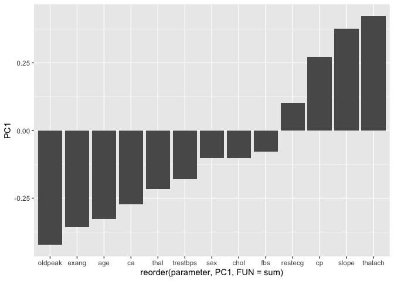

PCA of the Heart :hearts:
================


This is an analysis of the Cleveland Heart Dataset using Principal
component analysis (PCA).

## Dataset

For a description of the dataset and the variables, see
[here](README.md)

## Loading Data

But first, we need to load the `tidyverse` package

``` r
library(tidyverse)
```

    ## ── Attaching packages ─────────────────────────────────────── tidyverse 1.3.1 ──

    ## ✓ ggplot2 3.3.3     ✓ purrr   0.3.4
    ## ✓ tibble  3.1.2     ✓ dplyr   1.0.6
    ## ✓ tidyr   1.1.3     ✓ stringr 1.4.0
    ## ✓ readr   1.4.0     ✓ forcats 0.5.1

    ## ── Conflicts ────────────────────────────────────────── tidyverse_conflicts() ──
    ## x dplyr::filter() masks stats::filter()
    ## x dplyr::lag()    masks stats::lag()

Let’s load dataset into a table and take a glimpse at the data

``` r
heart = read_tsv("https://raw.githubusercontent.com/ahmedmoustafa/notebooks/main/Heart/Heart.tsv")
```

    ## 
    ## ── Column specification ────────────────────────────────────────────────────────
    ## cols(
    ##   id = col_double(),
    ##   age = col_double(),
    ##   sex = col_double(),
    ##   cp = col_double(),
    ##   trestbps = col_double(),
    ##   chol = col_double(),
    ##   fbs = col_double(),
    ##   restecg = col_double(),
    ##   thalach = col_double(),
    ##   exang = col_double(),
    ##   oldpeak = col_double(),
    ##   slope = col_double(),
    ##   ca = col_double(),
    ##   thal = col_double(),
    ##   diagnosis = col_double()
    ## )

``` r
glimpse(heart)
```

    ## Rows: 303
    ## Columns: 15
    ## $ id        <dbl> 1, 2, 3, 4, 5, 6, 7, 8, 9, 10, 11, 12, 13, 14, 15, 16, 17, 1…
    ## $ age       <dbl> 63, 37, 41, 56, 57, 57, 56, 44, 52, 57, 54, 48, 49, 64, 58, …
    ## $ sex       <dbl> 1, 1, 0, 1, 0, 1, 0, 1, 1, 1, 1, 0, 1, 1, 0, 0, 0, 0, 1, 0, …
    ## $ cp        <dbl> 3, 2, 1, 1, 0, 0, 1, 1, 2, 2, 0, 2, 1, 3, 3, 2, 2, 3, 0, 3, …
    ## $ trestbps  <dbl> 145, 130, 130, 120, 120, 140, 140, 120, 172, 150, 140, 130, …
    ## $ chol      <dbl> 233, 250, 204, 236, 354, 192, 294, 263, 199, 168, 239, 275, …
    ## $ fbs       <dbl> 1, 0, 0, 0, 0, 0, 0, 0, 1, 0, 0, 0, 0, 0, 1, 0, 0, 0, 0, 0, …
    ## $ restecg   <dbl> 0, 1, 0, 1, 1, 1, 0, 1, 1, 1, 1, 1, 1, 0, 0, 1, 1, 1, 1, 1, …
    ## $ thalach   <dbl> 150, 187, 172, 178, 163, 148, 153, 173, 162, 174, 160, 139, …
    ## $ exang     <dbl> 0, 0, 0, 0, 1, 0, 0, 0, 0, 0, 0, 0, 0, 1, 0, 0, 0, 0, 0, 0, …
    ## $ oldpeak   <dbl> 2.3, 3.5, 1.4, 0.8, 0.6, 0.4, 1.3, 0.0, 0.5, 1.6, 1.2, 0.2, …
    ## $ slope     <dbl> 0, 0, 2, 2, 2, 1, 1, 2, 2, 2, 2, 2, 2, 1, 2, 1, 2, 0, 2, 2, …
    ## $ ca        <dbl> 0, 0, 0, 0, 0, 0, 0, 0, 0, 0, 0, 0, 0, 0, 0, 0, 0, 0, 0, 2, …
    ## $ thal      <dbl> 1, 2, 2, 2, 2, 1, 2, 3, 3, 2, 2, 2, 2, 2, 2, 2, 2, 2, 2, 2, …
    ## $ diagnosis <dbl> 1, 1, 1, 1, 1, 1, 1, 1, 1, 1, 1, 1, 1, 1, 1, 1, 1, 1, 1, 1, …

We will split the dataset into **train** and **test** subsets. The
**train** subset will be used to build the PCA and the **test** subset
will be used to predict the diagnosis (assuming it is not known) using
the **train**-based built PCA.

There are 303 records (rows) in the dataset. We will take 95% of the
records for **train** and 5% for **test**

The **train** subset:

``` r
set.seed(123456) # sets the seed of R's random number generator

train = slice_sample(heart %>% group_by(diagnosis),
                     prop = 0.95,
                     replace = FALSE) %>%
  arrange(id)

glimpse(train)
```

    ## Rows: 287
    ## Columns: 15
    ## Groups: diagnosis [2]
    ## $ id        <dbl> 1, 2, 3, 4, 5, 6, 7, 8, 9, 10, 11, 13, 14, 15, 16, 17, 18, 1…
    ## $ age       <dbl> 63, 37, 41, 56, 57, 57, 56, 44, 52, 57, 54, 49, 64, 58, 50, …
    ## $ sex       <dbl> 1, 1, 0, 1, 0, 1, 0, 1, 1, 1, 1, 1, 1, 0, 0, 0, 0, 1, 0, 1, …
    ## $ cp        <dbl> 3, 2, 1, 1, 0, 0, 1, 1, 2, 2, 0, 1, 3, 3, 2, 2, 3, 0, 3, 0, …
    ## $ trestbps  <dbl> 145, 130, 130, 120, 120, 140, 140, 120, 172, 150, 140, 130, …
    ## $ chol      <dbl> 233, 250, 204, 236, 354, 192, 294, 263, 199, 168, 239, 266, …
    ## $ fbs       <dbl> 1, 0, 0, 0, 0, 0, 0, 0, 1, 0, 0, 0, 0, 1, 0, 0, 0, 0, 0, 0, …
    ## $ restecg   <dbl> 0, 1, 0, 1, 1, 1, 0, 1, 1, 1, 1, 1, 0, 0, 1, 1, 1, 1, 1, 1, …
    ## $ thalach   <dbl> 150, 187, 172, 178, 163, 148, 153, 173, 162, 174, 160, 171, …
    ## $ exang     <dbl> 0, 0, 0, 0, 1, 0, 0, 0, 0, 0, 0, 0, 1, 0, 0, 0, 0, 0, 0, 0, …
    ## $ oldpeak   <dbl> 2.3, 3.5, 1.4, 0.8, 0.6, 0.4, 1.3, 0.0, 0.5, 1.6, 1.2, 0.6, …
    ## $ slope     <dbl> 0, 0, 2, 2, 2, 1, 1, 2, 2, 2, 2, 2, 1, 2, 1, 2, 0, 2, 2, 1, …
    ## $ ca        <dbl> 0, 0, 0, 0, 0, 0, 0, 0, 0, 0, 0, 0, 0, 0, 0, 0, 0, 0, 2, 0, …
    ## $ thal      <dbl> 1, 2, 2, 2, 2, 1, 2, 3, 3, 2, 2, 2, 2, 2, 2, 2, 2, 2, 2, 3, …
    ## $ diagnosis <dbl> 1, 1, 1, 1, 1, 1, 1, 1, 1, 1, 1, 1, 1, 1, 1, 1, 1, 1, 1, 1, …

The **test** subset:

``` r
test = heart[-train$id, ]
glimpse(test)
```

    ## Rows: 16
    ## Columns: 15
    ## $ id        <dbl> 12, 27, 32, 35, 39, 79, 97, 117, 119, 188, 214, 224, 254, 27…
    ## $ age       <dbl> 48, 59, 65, 51, 65, 52, 62, 41, 46, 54, 61, 56, 67, 47, 58, …
    ## $ sex       <dbl> 0, 1, 1, 1, 0, 1, 0, 1, 0, 1, 0, 0, 1, 1, 0, 1
    ## $ cp        <dbl> 2, 2, 0, 3, 2, 1, 0, 2, 1, 0, 0, 0, 0, 0, 1, 2
    ## $ trestbps  <dbl> 130, 150, 120, 125, 155, 128, 140, 130, 105, 124, 145, 200, …
    ## $ chol      <dbl> 275, 212, 177, 213, 269, 205, 394, 214, 204, 266, 307, 288, …
    ## $ fbs       <dbl> 0, 1, 0, 0, 0, 1, 0, 0, 0, 0, 0, 1, 0, 0, 1, 0
    ## $ restecg   <dbl> 1, 1, 1, 0, 1, 1, 0, 0, 1, 0, 0, 0, 0, 0, 0, 0
    ## $ thalach   <dbl> 139, 157, 140, 125, 148, 184, 157, 168, 172, 109, 146, 133, …
    ## $ exang     <dbl> 0, 0, 0, 1, 0, 0, 0, 0, 0, 1, 1, 1, 1, 1, 0, 0
    ## $ oldpeak   <dbl> 0.2, 1.6, 0.4, 1.4, 0.8, 0.0, 1.2, 2.0, 0.0, 2.2, 1.0, 4.0, …
    ## $ slope     <dbl> 2, 2, 2, 2, 2, 2, 1, 1, 2, 1, 1, 0, 1, 1, 2, 1
    ## $ ca        <dbl> 0, 0, 0, 1, 0, 0, 0, 0, 0, 1, 0, 2, 2, 1, 2, 0
    ## $ thal      <dbl> 2, 2, 3, 2, 2, 2, 2, 2, 2, 3, 3, 3, 2, 2, 2, 3
    ## $ diagnosis <dbl> 1, 1, 1, 1, 1, 1, 1, 1, 1, 0, 0, 0, 0, 0, 0, 0

Now we will explore the dataset using [Principal Component
Analysis](https://en.wikipedia.org/wiki/Principal_component_analysis).
First, we need to remove `id` (subject id) and `diagnosis` (where 1 =
heart disease, and 0 = no heart disease) because they should not be part
of the PCA. We want to see if the other 13 parameters can separate
between subjects by the diagnosis of heart disease.

``` r
m = train %>% ungroup() %>% select(-id, -diagnosis)
head(m)
```

| age | sex |  cp | trestbps | chol | fbs | restecg | thalach | exang | oldpeak | slope |  ca | thal |
|----:|----:|----:|---------:|-----:|----:|--------:|--------:|------:|--------:|------:|----:|-----:|
|  63 |   1 |   3 |      145 |  233 |   1 |       0 |     150 |     0 |     2.3 |     0 |   0 |    1 |
|  37 |   1 |   2 |      130 |  250 |   0 |       1 |     187 |     0 |     3.5 |     0 |   0 |    2 |
|  41 |   0 |   1 |      130 |  204 |   0 |       0 |     172 |     0 |     1.4 |     2 |   0 |    2 |
|  56 |   1 |   1 |      120 |  236 |   0 |       1 |     178 |     0 |     0.8 |     2 |   0 |    2 |
|  57 |   0 |   0 |      120 |  354 |   0 |       1 |     163 |     1 |     0.6 |     2 |   0 |    2 |
|  57 |   1 |   0 |      140 |  192 |   0 |       1 |     148 |     0 |     0.4 |     1 |   0 |    1 |

## Basic PCA Steps

``` r
pca = prcomp(m, scale. = TRUE)
summary(pca)
```

    ## Importance of components:
    ##                           PC1    PC2     PC3     PC4     PC5    PC6     PC7
    ## Standard deviation     1.6471 1.2344 1.10785 1.09609 1.00933 0.9907 0.93020
    ## Proportion of Variance 0.2087 0.1172 0.09441 0.09242 0.07837 0.0755 0.06656
    ## Cumulative Proportion  0.2087 0.3259 0.42033 0.51274 0.59111 0.6666 0.73317
    ##                            PC8    PC9   PC10   PC11    PC12    PC13
    ## Standard deviation     0.89932 0.8433 0.7941 0.7220 0.65225 0.60959
    ## Proportion of Variance 0.06221 0.0547 0.0485 0.0401 0.03273 0.02858
    ## Cumulative Proportion  0.79538 0.8501 0.8986 0.9387 0.97142 1.00000

The above summary is telling us that PC1 and PC2 explain 21% and 11% of
the variance in the dataset, respectively. And together (cumulatively),
they explain about 33% of the variance.

``` r
plot(pca)
```

<!-- -->

## Investigating the PCA Result

The projection (coordinates) of the subjects is stored in a matrix
called `x` within the generated `pca` object. We will extend the
**train** table with, let’s say, the first two principal components as
additional columns

``` r
t1 = train %>% add_column (PC1 = pca$x[, 1], PC2 = pca$x[, 2])
glimpse(t1)
```

    ## Rows: 287
    ## Columns: 17
    ## Groups: diagnosis [2]
    ## $ id        <dbl> 1, 2, 3, 4, 5, 6, 7, 8, 9, 10, 11, 13, 14, 15, 16, 17, 18, 1…
    ## $ age       <dbl> 63, 37, 41, 56, 57, 57, 56, 44, 52, 57, 54, 49, 64, 58, 50, …
    ## $ sex       <dbl> 1, 1, 0, 1, 0, 1, 0, 1, 1, 1, 1, 1, 1, 0, 0, 0, 0, 1, 0, 1, …
    ## $ cp        <dbl> 3, 2, 1, 1, 0, 0, 1, 1, 2, 2, 0, 1, 3, 3, 2, 2, 3, 0, 3, 0, …
    ## $ trestbps  <dbl> 145, 130, 130, 120, 120, 140, 140, 120, 172, 150, 140, 130, …
    ## $ chol      <dbl> 233, 250, 204, 236, 354, 192, 294, 263, 199, 168, 239, 266, …
    ## $ fbs       <dbl> 1, 0, 0, 0, 0, 0, 0, 0, 1, 0, 0, 0, 0, 1, 0, 0, 0, 0, 0, 0, …
    ## $ restecg   <dbl> 0, 1, 0, 1, 1, 1, 0, 1, 1, 1, 1, 1, 0, 0, 1, 1, 1, 1, 1, 1, …
    ## $ thalach   <dbl> 150, 187, 172, 178, 163, 148, 153, 173, 162, 174, 160, 171, …
    ## $ exang     <dbl> 0, 0, 0, 0, 1, 0, 0, 0, 0, 0, 0, 0, 1, 0, 0, 0, 0, 0, 0, 0, …
    ## $ oldpeak   <dbl> 2.3, 3.5, 1.4, 0.8, 0.6, 0.4, 1.3, 0.0, 0.5, 1.6, 1.2, 0.6, …
    ## $ slope     <dbl> 0, 0, 2, 2, 2, 1, 1, 2, 2, 2, 2, 2, 1, 2, 1, 2, 0, 2, 2, 1, …
    ## $ ca        <dbl> 0, 0, 0, 0, 0, 0, 0, 0, 0, 0, 0, 0, 0, 0, 0, 0, 0, 0, 2, 0, …
    ## $ thal      <dbl> 1, 2, 2, 2, 2, 1, 2, 3, 3, 2, 2, 2, 2, 2, 2, 2, 2, 2, 2, 3, …
    ## $ diagnosis <dbl> 1, 1, 1, 1, 1, 1, 1, 1, 1, 1, 1, 1, 1, 1, 1, 1, 1, 1, 1, 1, …
    ## $ PC1       <dbl> -0.66344693, 0.44025065, 1.85441291, 1.66239504, 0.38527158,…
    ## $ PC2       <dbl> 2.428556297, -1.006055207, 0.003451545, -0.487946692, 0.1965…

Now, these two additional columns (PC1 and PC2) provide the coordinates
of the subjects (in the **train** subset) onto the first two components
(dimensions or axes).

Let’s plot the subjects on the new dimensions (PC1 and PC2) and overlay
the target (the diagnosis) to see if there is some structure among the
subjects based on the other 13 readings/parameters in the dataset

*Note*: we need to adjust the table and convert the categorical
variables `dbl` (numerical) into `factor`

``` r
t2 = t1 %>% mutate (sex = factor(sex), cp = factor(cp), fbs = factor(fbs),
                    restecg = factor(restecg), exang = factor(exang), slope = factor(slope), 
                    ca = factor(ca), thal = factor(thal), diagnosis = factor(diagnosis))
glimpse(t2)
```

    ## Rows: 287
    ## Columns: 17
    ## Groups: diagnosis [2]
    ## $ id        <dbl> 1, 2, 3, 4, 5, 6, 7, 8, 9, 10, 11, 13, 14, 15, 16, 17, 18, 1…
    ## $ age       <dbl> 63, 37, 41, 56, 57, 57, 56, 44, 52, 57, 54, 49, 64, 58, 50, …
    ## $ sex       <fct> 1, 1, 0, 1, 0, 1, 0, 1, 1, 1, 1, 1, 1, 0, 0, 0, 0, 1, 0, 1, …
    ## $ cp        <fct> 3, 2, 1, 1, 0, 0, 1, 1, 2, 2, 0, 1, 3, 3, 2, 2, 3, 0, 3, 0, …
    ## $ trestbps  <dbl> 145, 130, 130, 120, 120, 140, 140, 120, 172, 150, 140, 130, …
    ## $ chol      <dbl> 233, 250, 204, 236, 354, 192, 294, 263, 199, 168, 239, 266, …
    ## $ fbs       <fct> 1, 0, 0, 0, 0, 0, 0, 0, 1, 0, 0, 0, 0, 1, 0, 0, 0, 0, 0, 0, …
    ## $ restecg   <fct> 0, 1, 0, 1, 1, 1, 0, 1, 1, 1, 1, 1, 0, 0, 1, 1, 1, 1, 1, 1, …
    ## $ thalach   <dbl> 150, 187, 172, 178, 163, 148, 153, 173, 162, 174, 160, 171, …
    ## $ exang     <fct> 0, 0, 0, 0, 1, 0, 0, 0, 0, 0, 0, 0, 1, 0, 0, 0, 0, 0, 0, 0, …
    ## $ oldpeak   <dbl> 2.3, 3.5, 1.4, 0.8, 0.6, 0.4, 1.3, 0.0, 0.5, 1.6, 1.2, 0.6, …
    ## $ slope     <fct> 0, 0, 2, 2, 2, 1, 1, 2, 2, 2, 2, 2, 1, 2, 1, 2, 0, 2, 2, 1, …
    ## $ ca        <fct> 0, 0, 0, 0, 0, 0, 0, 0, 0, 0, 0, 0, 0, 0, 0, 0, 0, 0, 2, 0, …
    ## $ thal      <fct> 1, 2, 2, 2, 2, 1, 2, 3, 3, 2, 2, 2, 2, 2, 2, 2, 2, 2, 2, 3, …
    ## $ diagnosis <fct> 1, 1, 1, 1, 1, 1, 1, 1, 1, 1, 1, 1, 1, 1, 1, 1, 1, 1, 1, 1, …
    ## $ PC1       <dbl> -0.66344693, 0.44025065, 1.85441291, 1.66239504, 0.38527158,…
    ## $ PC2       <dbl> 2.428556297, -1.006055207, 0.003451545, -0.487946692, 0.1965…

``` r
ggplot (t2) +
  geom_point(aes (x = PC1, y = PC2, color = diagnosis), size = 5, alpha = 0.8)
```

<!-- -->

The above figure shows that based on the 13 parameters, there are two
sub-populations within the study subjects, **with heart diseases** in
blue towards the positive side of PC1 and **without heart disease** in
red towards the negative side of PC1.

Then we can tell which of the 13 parameters is driving the separation by
PC1. We can look at the loadings on (contributions) those parameters on
PC1 through the `rotation` matrix of the `pca` variable:

We can plot the loading on PC1 as a barplot to see the direction and
magnitude of the contributions of the different parameters.

We need to extract the loadings from the `pca` variable. The row names
of the rotation matrix will be used as a new column, which we are going
to call it parameter.

``` r
loadings = rownames_to_column(as.data.frame(pca$rotation), var = "parameter")
loadings
```

| parameter |        PC1 |        PC2 |        PC3 |        PC4 |        PC5 |        PC6 |        PC7 |        PC8 |        PC9 |       PC10 |       PC11 |       PC12 |       PC13 |
|:----------|-----------:|-----------:|-----------:|-----------:|-----------:|-----------:|-----------:|-----------:|-----------:|-----------:|-----------:|-----------:|-----------:|
| age       | -0.3263089 |  0.4266427 | -0.0769087 |  0.0896244 | -0.2442061 |  0.1594025 | -0.1495022 |  0.1214077 | -0.4499553 | -0.0061388 |  0.0450066 | -0.5619204 | -0.2348126 |
| sex       | -0.1019401 | -0.3424557 |  0.5833974 | -0.2431422 |  0.0405392 | -0.0293870 | -0.1109854 |  0.1447815 | -0.2510575 | -0.5676810 |  0.2146797 | -0.0314986 | -0.0685864 |
| cp        |  0.2729688 |  0.3165679 |  0.0304468 | -0.4478370 |  0.2363221 |  0.2345142 | -0.0870307 | -0.1098935 | -0.3261047 | -0.1149907 | -0.5864368 |  0.1677028 |  0.0411391 |
| trestbps  | -0.1792302 |  0.4275109 |  0.1294321 | -0.1045304 |  0.1875903 |  0.0851125 |  0.3751947 |  0.6840089 |  0.1955215 |  0.0057210 |  0.1172140 |  0.2328689 |  0.0113895 |
| chol      | -0.1011258 |  0.3510406 | -0.0043692 |  0.5453055 |  0.3483853 |  0.0506952 |  0.0865488 | -0.3846002 | -0.0034994 | -0.4972171 |  0.0977162 |  0.1814545 |  0.0102551 |
| fbs       | -0.0783630 |  0.3107031 |  0.3484830 | -0.3288940 | -0.2860711 | -0.2172612 |  0.4655019 | -0.5033586 |  0.0339193 |  0.1342427 |  0.1709615 | -0.0578549 |  0.1298593 |
| restecg   |  0.1025968 | -0.2464071 | -0.2740550 | -0.0725168 | -0.2592533 |  0.6909267 |  0.4765949 | -0.0634726 |  0.0085526 | -0.2410280 |  0.1005075 | -0.0228467 | -0.0619496 |
| thalach   |  0.4241595 |  0.0594578 |  0.2522923 |  0.0216103 |  0.3057164 |  0.0699685 |  0.0788977 | -0.0198624 |  0.4325189 | -0.0023291 | -0.0591177 | -0.5693673 | -0.3642878 |
| exang     | -0.3573591 | -0.2671979 |  0.0108465 |  0.1751885 | -0.0190813 | -0.2902054 |  0.4478817 |  0.0596342 | -0.0192811 | -0.1146122 | -0.6584836 | -0.1303724 | -0.1313326 |
| oldpeak   | -0.4228949 | -0.0597430 | -0.1515378 | -0.2647536 |  0.3136359 |  0.1543149 | -0.1241352 | -0.0823962 |  0.2906941 | -0.0993225 | -0.0216542 | -0.3768395 |  0.5859251 |
| slope     |  0.3767993 |  0.0513591 |  0.2987301 |  0.4026413 | -0.2708201 |  0.0678808 |  0.0600797 |  0.2142088 | -0.1118375 | -0.0221060 | -0.1597306 | -0.1785531 |  0.6373281 |
| ca        | -0.2724488 |  0.1129743 |  0.3349485 |  0.0794526 | -0.4130708 |  0.3325414 | -0.3623242 | -0.0808033 |  0.4804642 | -0.0215651 | -0.2853582 |  0.2120078 | -0.1334107 |
| thal      | -0.2166542 | -0.2081750 |  0.3890042 |  0.2022165 |  0.3756264 |  0.3952400 |  0.0924102 | -0.1260285 | -0.2709256 |  0.5631559 |  0.0292246 |  0.0639812 | -0.0168158 |

Plotting the loadings as a barplot:

``` r
ggplot(loadings) +
  geom_bar(aes(x = parameter, y = PC1), stat = "identity")
```

<!-- -->

It will be helpful to rearrange the bars (parameters) on the x-axis
according to the values of the loadings on the y-axis

``` r
ggplot(loadings) +
  geom_bar(aes(x = reorder (parameter, PC1, FUN = sum), y = PC1), stat = "identity")
```

<!-- -->

The above figure tells us that `oldpeak` ([ST depression induced by
exercise relative to rest](https://en.wikipedia.org/wiki/ST_depression))
is the largest contributor to PC1 on the negative side. At the same time
`thalach` ([maximum heart rate
achieved](https://www.cdc.gov/physicalactivity/basics/measuring/heartrate.htm))
is the largest contributor on the positive side PC1.

## Prediction

Here we are going to predict – *not doing PCA again* – the coordinate
(transformation) of the **test** subset on the PC1 and PC2 plane
determined based on the **train** subset.

``` r
prediction = predict(pca, test %>% select(-id, -diagnosis))
prediction
```

|        PC1 |        PC2 |        PC3 |        PC4 |        PC5 |        PC6 |        PC7 |        PC8 |        PC9 |       PC10 |       PC11 |       PC12 |       PC13 |
|-----------:|-----------:|-----------:|-----------:|-----------:|-----------:|-----------:|-----------:|-----------:|-----------:|-----------:|-----------:|-----------:|
|  1.7505581 |  0.6283831 | -1.3447322 |  0.5348970 | -0.1006042 |  0.5728487 |  0.4403159 | -0.1792925 | -0.3838195 |  0.0438228 | -0.3415695 |  0.9574778 |  0.7726073 |
|  0.6536646 |  1.3337668 |  0.9877048 | -1.9083024 | -0.7160443 |  0.3582471 |  1.5932854 | -0.0036037 | -0.4528000 | -0.3123868 |  0.6088128 | -0.7983178 |  1.1299550 |
|  0.2881610 | -1.1890442 |  0.2581184 |  0.3499926 | -1.0230273 |  0.8738299 | -0.1608728 |  0.6856547 | -1.6083057 |  0.8631801 |  1.1269519 | -0.9471982 |  0.1391057 |
| -0.0510018 | -0.3012615 |  0.4448627 | -0.7153851 | -0.1504131 | -0.7900561 | -0.6212345 |  0.4268619 | -0.9984913 | -0.6067482 | -2.4401401 |  0.5107548 |  1.1024951 |
|  0.8425440 |  1.9970051 | -1.2780189 |  0.3585589 | -0.0420387 |  1.0941211 |  0.6657567 |  1.0379452 | -0.6179397 |  0.0467173 | -0.1325964 | -0.1858486 |  0.5093582 |
|  1.9586913 |  0.2562097 |  1.3547226 | -1.0962415 | -1.1162742 | -0.2359323 |  1.5615196 | -0.7256440 |  0.0662245 | -0.0031260 |  0.9384201 | -1.0045140 |  0.0257106 |
| -0.4517599 |  2.1088970 | -1.3529944 |  2.0112310 |  1.4195379 | -0.7050312 | -0.2487717 | -0.5824327 |  0.4148176 | -0.4805629 |  1.1593556 | -0.1077060 | -0.3361478 |
|  0.9771101 | -0.4856192 |  0.0983937 | -1.5993208 |  1.5607290 | -0.7688310 | -0.8809913 |  0.1163357 |  0.5801152 | -0.2508890 | -0.0677620 |  0.1420130 |  0.3197959 |
|  2.6379549 | -0.7820993 | -1.1527573 |  0.4261809 | -0.6446348 |  0.1910810 |  0.0256294 | -0.5809426 |  0.3196649 |  0.8463137 | -0.1704089 | -0.4215880 |  0.1317223 |
| -2.5884024 | -1.2453782 |  0.1837735 |  0.6574297 |  0.4785940 | -0.7862609 | -0.4386659 | -0.2429416 | -0.5722216 |  0.0920714 | -0.2974730 |  0.5427953 |  0.5087374 |
| -1.5396894 |  0.6704134 | -0.7429593 |  1.7859848 |  1.2792097 | -0.8240390 |  0.8189480 |  0.1998085 | -0.2076096 |  1.0432682 | -0.3017038 | -0.1230912 | -0.5580377 |
| -4.5844054 |  2.5127332 |  0.3424523 | -0.9279539 |  1.3416402 | -0.3870388 |  2.2378098 |  0.3275423 |  2.3765188 |  1.3717633 |  0.1856448 |  0.7533556 |  0.3903454 |
| -2.0162368 | -0.4584366 | -0.0696665 |  1.3399632 | -1.0508482 | -1.0851150 | -1.4278457 | -1.0699409 | -0.6089623 | -1.0639177 | -0.6751128 | -0.3409789 | -0.8410161 |
| -1.2604752 | -1.4393354 | -0.2375231 |  0.7229209 | -0.2352559 | -1.7379926 | -0.6060755 | -0.6809673 | -0.0796324 | -0.8026460 | -0.4585785 |  0.8761860 | -0.0351644 |
|  0.3462632 |  2.8547857 |  0.9140134 |  0.9056052 | -1.2383211 | -0.6811700 |  0.3535882 | -1.4980347 |  0.7090789 |  0.5405189 |  0.1143227 |  0.4482801 |  0.4126448 |
| -0.4245927 |  0.9421566 |  0.6319438 | -0.9181860 |  1.1383098 |  0.2170182 | -0.6139373 |  1.2504492 | -1.5232233 |  0.7709777 |  0.3223994 | -0.2313178 | -0.6782645 |

Extend the **test** table with the predicted coordinnates, PC1, and PC2.

``` r
t3 = test %>% mutate (sex = factor(sex), cp = factor(cp), fbs = factor(fbs),
                      restecg = factor(restecg), exang = factor(exang), slope = factor(slope), 
                      ca = factor(ca), thal = factor(thal), diagnosis = factor(diagnosis)) %>%
  add_column(PC1 = prediction[, 1],
             PC2 = prediction[, 2])
glimpse(t3)
```

    ## Rows: 16
    ## Columns: 17
    ## $ id        <dbl> 12, 27, 32, 35, 39, 79, 97, 117, 119, 188, 214, 224, 254, 27…
    ## $ age       <dbl> 48, 59, 65, 51, 65, 52, 62, 41, 46, 54, 61, 56, 67, 47, 58, …
    ## $ sex       <fct> 0, 1, 1, 1, 0, 1, 0, 1, 0, 1, 0, 0, 1, 1, 0, 1
    ## $ cp        <fct> 2, 2, 0, 3, 2, 1, 0, 2, 1, 0, 0, 0, 0, 0, 1, 2
    ## $ trestbps  <dbl> 130, 150, 120, 125, 155, 128, 140, 130, 105, 124, 145, 200, …
    ## $ chol      <dbl> 275, 212, 177, 213, 269, 205, 394, 214, 204, 266, 307, 288, …
    ## $ fbs       <fct> 0, 1, 0, 0, 0, 1, 0, 0, 0, 0, 0, 1, 0, 0, 1, 0
    ## $ restecg   <fct> 1, 1, 1, 0, 1, 1, 0, 0, 1, 0, 0, 0, 0, 0, 0, 0
    ## $ thalach   <dbl> 139, 157, 140, 125, 148, 184, 157, 168, 172, 109, 146, 133, …
    ## $ exang     <fct> 0, 0, 0, 1, 0, 0, 0, 0, 0, 1, 1, 1, 1, 1, 0, 0
    ## $ oldpeak   <dbl> 0.2, 1.6, 0.4, 1.4, 0.8, 0.0, 1.2, 2.0, 0.0, 2.2, 1.0, 4.0, …
    ## $ slope     <fct> 2, 2, 2, 2, 2, 2, 1, 1, 2, 1, 1, 0, 1, 1, 2, 1
    ## $ ca        <fct> 0, 0, 0, 1, 0, 0, 0, 0, 0, 1, 0, 2, 2, 1, 2, 0
    ## $ thal      <fct> 2, 2, 3, 2, 2, 2, 2, 2, 2, 3, 3, 3, 2, 2, 2, 3
    ## $ diagnosis <fct> 1, 1, 1, 1, 1, 1, 1, 1, 1, 0, 0, 0, 0, 0, 0, 0
    ## $ PC1       <dbl> 1.7505581, 0.6536646, 0.2881610, -0.0510018, 0.8425440, 1.95…
    ## $ PC2       <dbl> 0.6283831, 1.3337668, -1.1890442, -0.3012615, 1.9970051, 0.2…

Let’s plot the predictions for the **test** subjects (dark) over the
**train** subjects (light)

``` r
ggplot () +
  geom_point(data = t2, aes (x = PC1, y = PC2, color = diagnosis), size = 5, alpha = 0.1) +
  geom_point(data = t3, aes (x = PC1, y = PC2, color = diagnosis), size = 5, alpha = 0.9)
```

<!-- -->

No too bad :wink:

------------------------------------------------------------------------

## Summary

-   We explored the heart dataset using PCA
-   PCA showed that there were sub-populations among the subjects
-   The separation between the two sub-populations was due to PC1
-   PCA indicated that `oldpeak` was a major contributor to PC1
-   We were able to predict the locations (coordinates) of test subjects
    on the computed PCA plane (PC1 and PC2)
