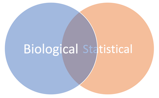

Microarray Gene Expression Analysis with R
================
Ahmed Moustafa (<amoustafa@aucegypt.edu>)
April 20, 2022

“They have just found the gene for shyness. They would have found it
earlier, but it was hiding behind two other genes.” –[Stuart
Peirson](https://www.ndcn.ox.ac.uk/team/stuart-peirson)

## Loading

First, we are going to load the dataset from the `.tsv` file into `R` as
a variable called `data` using the
[`read.table`](http://www.inside-r.org/r-doc/utils/read.table) function.

**Note:** `.tsv` stands for [tab-separated
values](https://en.wikipedia.org/wiki/Tab-separated_values), which is
simply a plain text file. The file itself can downloaded from
[here](https://media.githubusercontent.com/media/ahmedmoustafa/gene-expression-datasets/main/datasets/irf6/irf6.tsv).

In the following code, `data` is just an arbitrary **variable** name to
hold the result of `read.table`. See here for [**valid** variable
names](https://www.datamentor.io/r-programming/variable-constant/) in
**R**. Also it is recommended to see here for generally [Good Variable
Names](https://wiki.c2.com/?GoodVariableNames).

``` r
# Load the data from a file into a variable
data = read.table("https://media.githubusercontent.com/media/ahmedmoustafa/gene-expression-datasets/main/datasets/irf6/irf6.tsv", header = TRUE, row.names = 1)

# Convert the data.frame (table) in a matrix (numeric)
data = as.matrix(data)
```

**Note:** the hash sign (`#`) indicates that what comes after is a
*comment*. Comments are for documentation and readability of the code
and they are not evaluated (or executed).

## Checking

``` r
dim(data) # Dimension of the dataset
```

    ## [1] 45101     6

``` r
head(data) # First few rows
```

|                |     KO1 |     KO2 |     KO3 |     WT1 |     WT2 |     WT3 |
|:---------------|--------:|--------:|--------:|--------:|--------:|--------:|
| 1415670\_at    |  6531.0 |  5562.8 |  6822.4 |  7732.1 |  7191.2 |  7551.9 |
| 1415671\_at    | 11486.3 | 10542.7 | 10641.4 | 10408.2 |  9484.5 |  7650.2 |
| 1415672\_at    | 14339.2 | 13526.1 | 14444.7 | 12936.6 | 13841.7 | 13285.7 |
| 1415673\_at    |  3156.8 |  2219.5 |  3264.4 |  2374.2 |  2201.8 |  2525.3 |
| 1415674\_a\_at |  4002.0 |  3306.9 |  3777.0 |  3760.6 |  3137.0 |  2911.5 |
| 1415675\_at    |  3468.4 |  3347.4 |  3332.9 |  3073.5 |  3046.0 |  2914.4 |

## Number of Genes and IDs

``` r
number_of_genes = nrow(data) # number of genes = number of rows
number_of_genes
```

    ## [1] 45101

``` r
ids = row.names(data) # The ids of the genes are the names of the rows
head(ids)
```

    ## [1] "1415670_at"   "1415671_at"   "1415672_at"   "1415673_at"   "1415674_a_at"
    ## [6] "1415675_at"

## Exploring

Check the behavior of the data (e.g., normal?, skewed?)

``` r
hist(data, col = "gray", main="Histogram")
```

<!-- -->

## Transforming


transformation (why?)

``` r
data2 = log2(data)
hist(data2, col = "gray")
```

<!-- -->

## Boxplot

``` r
colors = c(rep("navy", 3), rep("orange", 3))
boxplot(data2, col = colors)
```

<!-- -->

## Clustering

Hierarchical clustering of the **samples** (i.e., columns) based on the
[correlation
coefficients](http://en.wikipedia.org/wiki/Pearson_product-moment_correlation_coefficient)
of the expression values

``` r
hc = hclust(as.dist(1 - cor(data2)))
plot(hc)
```

<!-- -->

To learn more about a function (e.g., `hclust`), you may type
`?function` (e.g., `?hclust`) in the `console` to launch `R`
documentation on that function.

## Splitting Data Matrix into two tables

``` r
ko = data2[, 1:3] # KO matrix
head(ko)
```

|                |      KO1 |      KO2 |      KO3 |
|:---------------|---------:|---------:|---------:|
| 1415670\_at    | 12.67309 | 12.44160 | 12.73606 |
| 1415671\_at    | 13.48763 | 13.36396 | 13.37740 |
| 1415672\_at    | 13.80768 | 13.72346 | 13.81825 |
| 1415673\_at    | 11.62425 | 11.11602 | 11.67260 |
| 1415674\_a\_at | 11.96651 | 11.69126 | 11.88303 |
| 1415675\_at    | 11.76005 | 11.70883 | 11.70256 |

``` r
wt = data2[, 4:6] # WT matrix
head(wt)
```

|                |      WT1 |      WT2 |      WT3 |
|:---------------|---------:|---------:|---------:|
| 1415670\_at    | 12.91664 | 12.81202 | 12.88262 |
| 1415671\_at    | 13.34543 | 13.21136 | 12.90128 |
| 1415672\_at    | 13.65917 | 13.75673 | 13.69759 |
| 1415673\_at    | 11.21323 | 11.10447 | 11.30224 |
| 1415674\_a\_at | 11.87675 | 11.61517 | 11.50755 |
| 1415675\_at    | 11.58567 | 11.57270 | 11.50898 |

## Gene (Row) Mean Expression

``` r
# Compute the means of the KO samples
ko.means = rowMeans(ko)
head(ko.means)
```

    ##   1415670_at   1415671_at   1415672_at   1415673_at 1415674_a_at   1415675_at 
    ##     12.61692     13.40966     13.78313     11.47096     11.84693     11.72381

``` r
# Compute the means of the WT samples
wt.means = rowMeans(wt)
head(wt.means)
```

    ##   1415670_at   1415671_at   1415672_at   1415673_at 1415674_a_at   1415675_at 
    ##     12.87043     13.15269     13.70450     11.20664     11.66649     11.55578

## Scatter

### Between the means

``` r
plot(ko.means ~ wt.means) # The actual scatter plot
abline(0, 1, col = "red") # Only a diagonal line
```

<!-- -->

### All by all

``` r
pairs(data2) # All pairwise comparisons
```

<!-- -->

# Differential Gene Expression Analysis



To identify Differentially Expressed Genes (DEGs), we will identify:

-   **Biologically** significantly differentially expressed
-   **Statistically** significantly differentially expressed

Then, we will take the **overlap** (**intersection**) of the two sets

## Biological Significance (fold-change)

``` r
fold = ko.means - wt.means # Difference between means
head(fold)
```

    ##   1415670_at   1415671_at   1415672_at   1415673_at 1415674_a_at   1415675_at 
    ##  -0.25351267   0.25697097   0.07863227   0.26431191   0.18044345   0.16803065

-   What do the positive and negative values of the fold-change
    indicate? Considering the `WT` condition is the **reference** (or
    **control**)

-   **+ve** fold-change
    
    **Up**-regulation
    

-   **-ve** fold-change
    
    **Down**-regulation
    

``` r
hist(fold, col = "gray") # Histogram of the fold
```

<!-- -->

## Statistical Significance (*p*-value)


-   To assess the statistical significance of the difference in the
    expression values for each gene between the two conditions (e.g.,
    `WT` and `KO`), we are going to use
    [*t*-test](http://en.wikipedia.org/wiki/Student%27s_t-test).

<!-- -->

## *t*-test

Let’s say there are two samples *x* and *y* from the two populations,
*X* and *Y*, respectively, to determine whether the means of two
populations are significantly different, we can use
[`t.test`](https://www.rdocumentation.org/packages/stats/versions/3.6.2/topics/t.test).

## *t*-test : Example 1

``` r
x = c(4, 3, 10, 7, 9) ; y = c(7, 4, 3, 8, 10)
t.test(x, y)
```

    ## 
    ##  Welch Two Sample t-test
    ## 
    ## data:  x and y
    ## t = 0.1066, df = 7.9743, p-value = 0.9177
    ## alternative hypothesis: true difference in means is not equal to 0
    ## 95 percent confidence interval:
    ##  -4.12888  4.52888
    ## sample estimates:
    ## mean of x mean of y 
    ##       6.6       6.4

``` r
t.test(x, y)$p.value
```

    ## [1] 0.917739

## *t*-test : Example 2

``` r
x = c(6, 8, 10, 7, 9) ; y = c(3, 2, 1, 4, 5)
t.test(x, y)
```

    ## 
    ##  Welch Two Sample t-test
    ## 
    ## data:  x and y
    ## t = 5, df = 8, p-value = 0.001053
    ## alternative hypothesis: true difference in means is not equal to 0
    ## 95 percent confidence interval:
    ##  2.693996 7.306004
    ## sample estimates:
    ## mean of x mean of y 
    ##         8         3

``` r
t.test(x, y)$p.value
```

    ## [1] 0.001052826

Let’s compute the *p*-value for all genes using a `for`-loop of
`t.test`, one gene at a time:

``` r
pvalue = NULL # Empty list for the p-values

for(i in 1 : number_of_genes) { # for each gene from to the number of genes
  x = wt[i, ] # wt values of gene number i
  y = ko[i, ] # ko values of gene number i
  t = t.test(x, y) # t-test between the two conditions
  pvalue[i] = t$p.value # Store p-value number i into the list of p-values
}
head(pvalue)
```

    ## [1] 0.092706280 0.182663337 0.129779075 0.272899180 0.262377176 0.005947807

``` r
hist(-log10(pvalue), col = "gray") # Histogram of p-values (-log10)
```

<!-- -->

## Volcano

``` r
plot(-log10(pvalue) ~ fold)
```

<!-- -->

``` r
fold_cutoff = 2
pvalue_cutoff = 0.01

plot(-log10(pvalue) ~ fold)

abline(v = fold_cutoff, col = "blue", lwd = 3)
abline(v = -fold_cutoff, col = "red", lwd = 3)
abline(h = -log10(pvalue_cutoff), col = "green", lwd = 3)
```

<!-- -->

## Filtering for DEGs

``` r
filter_by_fold = abs(fold) >= fold_cutoff # Biological
sum(filter_by_fold) # Number of genes staisfy the condition
```

    ## [1] 1051

``` r
filter_by_pvalue = pvalue <= pvalue_cutoff # Statistical
sum(filter_by_pvalue)
```

    ## [1] 1564

``` r
filter_combined = filter_by_fold & filter_by_pvalue # Combined
sum(filter_combined)
```

    ## [1] 276

``` r
filtered = data2[filter_combined, ]
dim(filtered)
```

    ## [1] 276   6

``` r
head(filtered)
```

|                |       KO1 |       KO2 |       KO3 |      WT1 |       WT2 |       WT3 |
|:---------------|----------:|----------:|----------:|---------:|----------:|----------:|
| 1416200\_at    | 13.312004 | 12.973357 | 12.868456 |  7.40429 |  8.558803 |  8.683696 |
| 1416236\_a\_at | 14.148397 | 14.039236 | 14.130007 | 12.23604 | 12.022403 | 11.495055 |
| 1417808\_at    |  5.321928 |  5.442944 |  4.053111 | 15.16978 | 15.070087 | 14.753274 |
| 1417932\_at    | 10.602884 | 10.257152 | 10.496055 | 13.98445 | 14.203295 | 13.720960 |
| 1418050\_at    | 10.622052 | 10.975490 | 10.795066 | 12.86513 | 13.012048 | 12.658122 |
| 1418100\_at    |  9.117903 |  8.634811 |  9.057721 | 12.90358 | 12.842449 | 12.233769 |

``` r
plot(-log10(pvalue) ~ fold)
points(-log10(pvalue[filter_combined]) ~ fold[filter_combined],
       col = "green")
```

<!-- -->

## Exercise

On the volcano plot, highlight the up-regulated genes in red and the
download-regulated genes in blue

<details>
<summary>
Click here for the solution
</summary>

-   Up-regulated genes

``` r
# Screen for the up-regulated genes (+ve fold)
filter_up = filter_combined & fold > 0

head(filter_up)
```

    ##   1415670_at   1415671_at   1415672_at   1415673_at 1415674_a_at   1415675_at 
    ##        FALSE        FALSE        FALSE        FALSE        FALSE        FALSE

``` r
# Number of filtered genes
sum(filter_up)
```

    ## [1] 95

-   Down-regulated genes

``` r
# Screen for the down-regulated genes (-ve fold)
filter_down = filter_combined & fold < 0

head(filter_down)
```

    ##   1415670_at   1415671_at   1415672_at   1415673_at 1415674_a_at   1415675_at 
    ##        FALSE        FALSE        FALSE        FALSE        FALSE        FALSE

``` r
# Number of filtered genes
sum(filter_down)
```

    ## [1] 181

``` r
plot(-log10(pvalue) ~ fold)
points(-log10(pvalue[filter_up]) ~ fold[filter_up], col = "red")
points(-log10(pvalue[filter_down]) ~ fold[filter_down], col = "blue")
```

<!-- -->

</details>

## Heatmap

``` r
heatmap(filtered)
```

<!-- -->


-   By default, `heatmap` clusters genes (rows) and samples (columns)
    based on [the Euclidean
    distance](http://en.wikipedia.org/wiki/Euclidean_distance).

-   In the context of gene expression, we need to cluster genes and
    samples based on the correlation to explore patterns of
    **[co-regulation](http://dx.doi.org/10.1186/1471-2105-5-18)**
    (**co-expression**) - *Guilt by Association*.

-   To let `heatmap` cluster the genes and/or samples, the genes and
    samples will be clustered (grouped) by correlation coefficients
    (using `cor`) among the genes and samples.

``` r
# Clustering of the columns (samples)
col_dendrogram = as.dendrogram(hclust(as.dist(1-cor(filtered))))

# Clustering of the rows (genes)
row_dendrogram = as.dendrogram(hclust(as.dist(1-cor(t(filtered)))))
```

``` r
# Heatmap with the rows and columns clustered by correlation coefficients
heatmap(filtered, Rowv=row_dendrogram, Colv=col_dendrogram)
```

<!-- -->

``` r
library(gplots) # Load the gplots library
heatmap(filtered, Rowv=row_dendrogram, Colv=col_dendrogram, col = rev(redgreen(1024)))
```

<!-- -->

## Annnotation

To obtain the functional annotation of the differentially expressed
genes, we are going first to extract their probe ids:

``` r
filtered_ids = row.names(filtered) # ids of the filtered DE genes
length(filtered_ids)
```

    ## [1] 276

``` r
head(filtered_ids)
```

    ## [1] "1416200_at"   "1416236_a_at" "1417808_at"   "1417932_at"   "1418050_at"  
    ## [6] "1418100_at"

``` r
write.table (filtered_ids, "results/filtered_ids.txt", row.names = FALSE, col.names = FALSE, quote = FALSE)
```

### Using DAVID annotation database

We can obtain the annotation online via the [Database for Annotation,
Visualization and Integrated Discovery](https://david.ncifcrf.gov/)
([DAVID](https://david.ncifcrf.gov/)) by basically copying and pasting
the probe ids to DAVID and running the annotation analysis online.

### Using BioConductor annotation packages

Alternatively, we can generate a comprehensive functional annotation via
BioConductor packages
[`annaffy`](https://bioconductor.org/packages/release/bioc/html/annaffy.html)
and
[`mouse4302.db`](https://bioconductor.org/packages/release/data/annotation/html/mouse4302.db.html).

If the packages are not already installed, they can be installed using
the following code:

``` r
if (!requireNamespace("BiocManager", quietly = TRUE))
    install.packages("BiocManager")

BiocManager::install(c("annaffy", "mouse4302.db"))
```

Next the annotation can be obtained by loading the library:

``` r
library(annaffy)
```

    ## Loading required package: Biobase

    ## Loading required package: BiocGenerics

    ## Loading required package: parallel

    ## 
    ## Attaching package: 'BiocGenerics'

    ## The following objects are masked from 'package:parallel':
    ## 
    ##     clusterApply, clusterApplyLB, clusterCall, clusterEvalQ,
    ##     clusterExport, clusterMap, parApply, parCapply, parLapply,
    ##     parLapplyLB, parRapply, parSapply, parSapplyLB

    ## The following objects are masked from 'package:dplyr':
    ## 
    ##     combine, intersect, setdiff, union

    ## The following objects are masked from 'package:stats':
    ## 
    ##     IQR, mad, sd, var, xtabs

    ## The following objects are masked from 'package:base':
    ## 
    ##     anyDuplicated, append, as.data.frame, basename, cbind, colnames,
    ##     dirname, do.call, duplicated, eval, evalq, Filter, Find, get, grep,
    ##     grepl, intersect, is.unsorted, lapply, Map, mapply, match, mget,
    ##     order, paste, pmax, pmax.int, pmin, pmin.int, Position, rank,
    ##     rbind, Reduce, rownames, sapply, setdiff, sort, table, tapply,
    ##     union, unique, unsplit, which.max, which.min

    ## Welcome to Bioconductor
    ## 
    ##     Vignettes contain introductory material; view with
    ##     'browseVignettes()'. To cite Bioconductor, see
    ##     'citation("Biobase")', and for packages 'citation("pkgname")'.

    ## Loading required package: BiocManager

    ## Bioconductor version '3.13' is out-of-date; the current release version '3.14'
    ##   is available with R version '4.1'; see https://bioconductor.org/install

    ## Loading required package: GO.db

    ## Loading required package: AnnotationDbi

    ## Loading required package: stats4

    ## Loading required package: IRanges

    ## Loading required package: S4Vectors

    ## 
    ## Attaching package: 'S4Vectors'

    ## The following object is masked from 'package:gplots':
    ## 
    ##     space

    ## The following objects are masked from 'package:dplyr':
    ## 
    ##     first, rename

    ## The following object is masked from 'package:tidyr':
    ## 
    ##     expand

    ## The following objects are masked from 'package:base':
    ## 
    ##     expand.grid, I, unname

    ## 
    ## Attaching package: 'IRanges'

    ## The following objects are masked from 'package:dplyr':
    ## 
    ##     collapse, desc, slice

    ## The following object is masked from 'package:purrr':
    ## 
    ##     reduce

    ## 
    ## Attaching package: 'AnnotationDbi'

    ## The following object is masked from 'package:dplyr':
    ## 
    ##     select

    ## 

Then generating and exporting the annotation into HTML format:

``` r
annotation_table = aafTableAnn(filtered_ids, "mouse4302.db")
```

    ## Loading required package: mouse4302.db

    ## Loading required package: org.Mm.eg.db

    ## 

    ## 

``` r
saveHTML(annotation_table, file="results/filtered_annotation.html")
browseURL("results/filtered_annotation.html")
```

As an HTML file, the [annotation
table](https://htmlpreview.github.io/?https://raw.githubusercontent.com/ahmedmoustafa/Notebooks/main/Irf6/results/filtered_annotation.html)
can now be opened in any standard browser.

For a further focused functional analysis, let’s split the DEGs
according to the regulation pattern (up-regulated vs. down-regulated) to
determine which functions/pathways/processes turned on or off from WT to
KO:

## Up-regulated Genes

``` r
filtered_up_ids = ids[filter_up]
length (filtered_up_ids)
```

    ## [1] 95

``` r
write.table (filtered_up_ids, "results/filtered_up_ids.txt", row.names = FALSE, col.names = FALSE, quote = FALSE)
annotation_table = aafTableAnn(filtered_up_ids, "mouse4302.db")
saveHTML(annotation_table, file="results/filtered_up_annotation.html")
browseURL("results/filtered_up_annotation.html")
```

Here is the functional annotation of [the up-regulated
genes](https://htmlpreview.github.io/?https://raw.githubusercontent.com/ahmedmoustafa/Notebooks/main/Irf6/results/filtered_up_annotation.html)

## Down-regulated Genes

``` r
filtered_down_ids = ids[filter_down]
length (filtered_down_ids)
```

    ## [1] 181

``` r
write.table (filtered_down_ids, "results/filtered_down_ids.txt", row.names = FALSE, col.names = FALSE, quote = FALSE)
annotation_table = aafTableAnn(filtered_down_ids, "mouse4302.db")
saveHTML(annotation_table, file="results/filtered_down_annotation.html")
browseURL("results/filtered_down_annotation.html")
```

Here is the functional annotation of [the down-regulated
genes](https://htmlpreview.github.io/?https://raw.githubusercontent.com/ahmedmoustafa/Notebooks/main/Irf6/results/filtered_down_annotation.html)

## Sanity Check (Irf6)


## Multiple Testing Correction

We conducted 45,101 statistical tests. The computed *p*-values should be
corrected for [**multiple
testing**](https://en.wikipedia.org/wiki/Multiple_comparisons_problem).
The correction can be performed using `p.adjust`, which simply takes the
original *p*-values as a vector and returns the adjusted (corrected)
*p*-values using the [False Discovery
Rate](https://en.wikipedia.org/wiki/False_discovery_rate) adjustment
method:

``` r
adjusted.pvalues = p.adjust(pvalue, method = "fdr")
```

The number of the **original** *p*-values

0.05 is 5,099 while the number of **adjusted** *p*-values

0.05 is 9.

Here is a sample of the original *p*-values and their corresponding
adjusted *p*-values:

|    pvalue | adjusted.pvalue |
|----------:|----------------:|
| 0.0927063 |       0.5278755 |
| 0.1826633 |       0.6346918 |
| 0.1297791 |       0.5805456 |
| 0.2728992 |       0.7025472 |
| 0.2623772 |       0.6967834 |
| 0.0059478 |       0.2518079 |

And here is the overall relationship between the original and the
adjusted p-values:

<!-- -->

**Note:** Formally, we *should* have performed all *p*-value-based
analyses (filtering and downstream steps) based on the adjusted
*p*-values, but for the sake of simplicity, we proceeded with the
original *p*-values instead of the adjusted *p*-values.

------------------------------------------------------------------------


