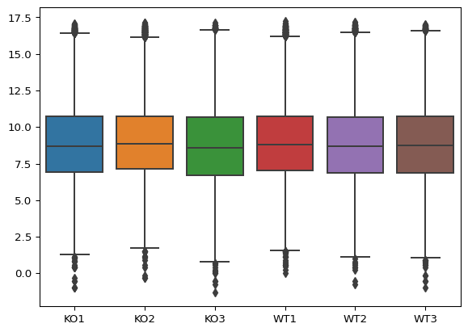
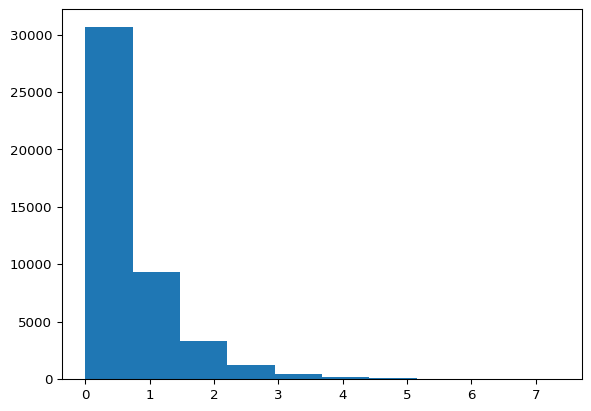
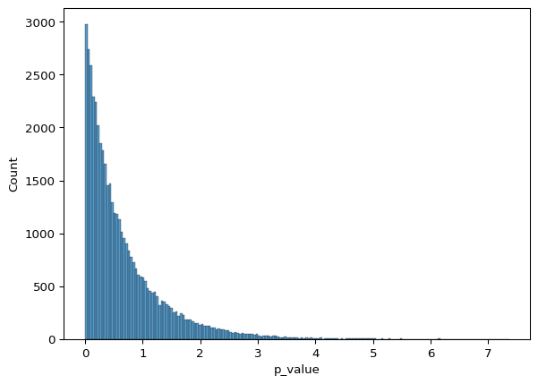
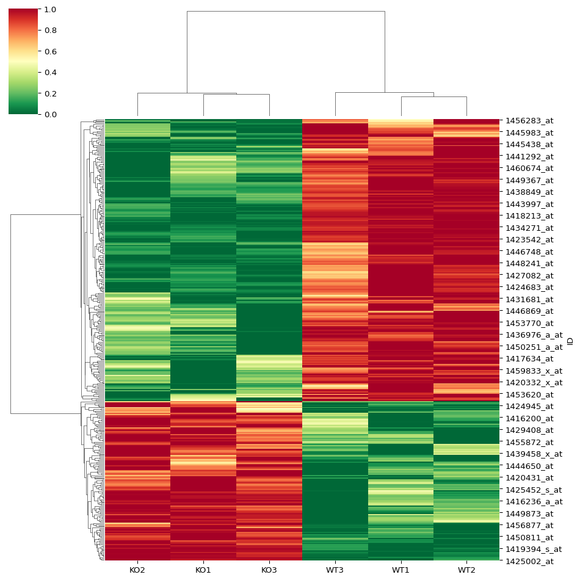
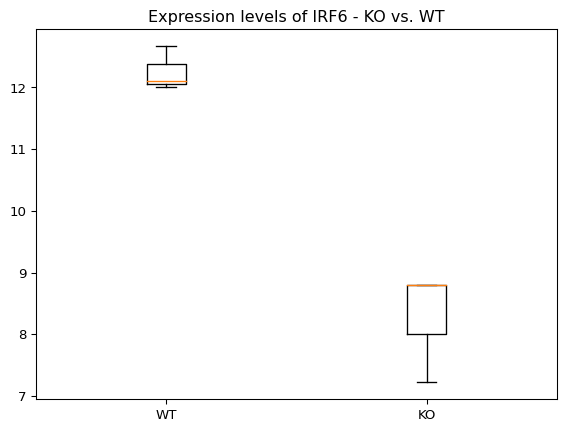

# Microarray Gene Expression Analysis with Python
Ahmed Moustafa
October 5, 2023

- [<span class="toc-section-number">1</span> Importing required
  libraries](#importing-required-libraries)
- [<span class="toc-section-number">2</span> Loading the
  data](#loading-the-data)
- [<span class="toc-section-number">3</span> Checking the data
  behavior](#checking-the-data-behavior)
  - [<span class="toc-section-number">3.1</span>
    Transforming](#transforming)
- [<span class="toc-section-number">4</span> Exploring the
  data](#exploring-the-data)
  - [<span class="toc-section-number">4.1</span> Boxplot](#boxplot)
  - [<span class="toc-section-number">4.2</span> Hierarchical
    clustering](#hierarchical-clustering)
- [<span class="toc-section-number">5</span> Biological
  signifiance](#biological-signifiance)
  - [<span class="toc-section-number">5.1</span> Slicing the dataset by
    condition](#slicing-the-dataset-by-condition)
  - [<span class="toc-section-number">5.2</span> Gene-wise mean
    expression](#gene-wise-mean-expression)
  - [<span class="toc-section-number">5.3</span> Scatter plot using
    Matplotlib](#scatter-plot-using-matplotlib)
  - [<span class="toc-section-number">5.4</span> Calculating the
    fold-change](#calculating-the-fold-change)
  - [<span class="toc-section-number">5.5</span> Scatter plot using
    Seaborn](#scatter-plot-using-seaborn)
  - [<span class="toc-section-number">5.6</span> Historgram of the
    fold-change](#historgram-of-the-fold-change)
- [<span class="toc-section-number">6</span> Statistical
  significance](#statistical-significance)
  - [<span class="toc-section-number">6.1</span> Calculating t-test
    *p*-value](#calculating-t-test-p-value)
  - [<span class="toc-section-number">6.2</span> Historgram of the
    *p*-value](#historgram-of-the-p-value)
- [<span class="toc-section-number">7</span> Biological & statistical
  signifiance](#biological-statistical-signifiance)
  - [<span class="toc-section-number">7.1</span> Volcano Plot (*p*-value
    vs. fold-change)](#volcano-plot-p-value-vs.-fold-change)
- [<span class="toc-section-number">8</span> Differentially expressed
  genes (DEGs)](#differentially-expressed-genes-degs)
  - [<span class="toc-section-number">8.1</span> Genes with significant
    fold-change](#genes-with-significant-fold-change)
  - [<span class="toc-section-number">8.2</span> Genes with significant
    *p*-value](#genes-with-significant-p-value)
  - [<span class="toc-section-number">8.3</span> Genes with significant
    fold-change & significant
    *p*-value](#genes-with-significant-fold-change-significant-p-value)
  - [<span class="toc-section-number">8.4</span> Heatmap](#heatmap)
- [<span class="toc-section-number">9</span> Sanity
  check](#sanity-check)

## Importing required libraries

``` python
import pandas as pd
import numpy as np
from scipy import stats
from scipy.cluster import hierarchy
import matplotlib.pyplot as plt
import seaborn as sns
```

## Loading the data

``` python
data = pd.read_table("https://media.githubusercontent.com/media/ahmedmoustafa/gene-expression-datasets/main/datasets/irf6/irf6.tsv", index_col='ID')
data.shape
```

    (45101, 6)

``` python
data.head()
```

<div>
<style scoped>
    .dataframe tbody tr th:only-of-type {
        vertical-align: middle;
    }
&#10;    .dataframe tbody tr th {
        vertical-align: top;
    }
&#10;    .dataframe thead th {
        text-align: right;
    }
</style>

|              | KO1     | KO2     | KO3     | WT1     | WT2     | WT3     |
|--------------|---------|---------|---------|---------|---------|---------|
| ID           |         |         |         |         |         |         |
| 1415670_at   | 6531.0  | 5562.8  | 6822.4  | 7732.1  | 7191.2  | 7551.9  |
| 1415671_at   | 11486.3 | 10542.7 | 10641.4 | 10408.2 | 9484.5  | 7650.2  |
| 1415672_at   | 14339.2 | 13526.1 | 14444.7 | 12936.6 | 13841.7 | 13285.7 |
| 1415673_at   | 3156.8  | 2219.5  | 3264.4  | 2374.2  | 2201.8  | 2525.3  |
| 1415674_a_at | 4002.0  | 3306.9  | 3777.0  | 3760.6  | 3137.0  | 2911.5  |

</div>

## Checking the data behavior

Check the behavior of the data (e.g., normal?, skewed?)

``` python
data.hist()
```

    array([[<Axes: title={'center': 'KO1'}>, <Axes: title={'center': 'KO2'}>],
           [<Axes: title={'center': 'KO3'}>, <Axes: title={'center': 'WT1'}>],
           [<Axes: title={'center': 'WT2'}>, <Axes: title={'center': 'WT3'}>]],
          dtype=object)


### Transforming

$log2$ transformation

``` python
data2 = np.log2(data)
data2.head()
data2.hist()
```

    array([[<Axes: title={'center': 'KO1'}>, <Axes: title={'center': 'KO2'}>],
           [<Axes: title={'center': 'KO3'}>, <Axes: title={'center': 'WT1'}>],
           [<Axes: title={'center': 'WT2'}>, <Axes: title={'center': 'WT3'}>]],
          dtype=object)


## Exploring the data

### Boxplot

#### Using Matplotlib

``` python
plt.boxplot(data2)
```

    {'whiskers': [<matplotlib.lines.Line2D at 0x281468dd0>,
      <matplotlib.lines.Line2D at 0x2814697d0>,
      <matplotlib.lines.Line2D at 0x281692d90>,
      <matplotlib.lines.Line2D at 0x2801b2410>,
      <matplotlib.lines.Line2D at 0x280c815d0>,
      <matplotlib.lines.Line2D at 0x280c83ed0>,
      <matplotlib.lines.Line2D at 0x2816e9250>,
      <matplotlib.lines.Line2D at 0x2816ebb50>,
      <matplotlib.lines.Line2D at 0x28131c6d0>,
      <matplotlib.lines.Line2D at 0x28131c7d0>,
      <matplotlib.lines.Line2D at 0x2816f07d0>,
      <matplotlib.lines.Line2D at 0x2816f22d0>],
     'caps': [<matplotlib.lines.Line2D at 0x28146ad90>,
      <matplotlib.lines.Line2D at 0x281469b50>,
      <matplotlib.lines.Line2D at 0x281693850>,
      <matplotlib.lines.Line2D at 0x2816934d0>,
      <matplotlib.lines.Line2D at 0x280c832d0>,
      <matplotlib.lines.Line2D at 0x280c81ad0>,
      <matplotlib.lines.Line2D at 0x2816eb250>,
      <matplotlib.lines.Line2D at 0x2816e9210>,
      <matplotlib.lines.Line2D at 0x28131cad0>,
      <matplotlib.lines.Line2D at 0x28131de90>,
      <matplotlib.lines.Line2D at 0x2816f2410>,
      <matplotlib.lines.Line2D at 0x2816f0e50>],
     'boxes': [<matplotlib.lines.Line2D at 0x281bcf010>,
      <matplotlib.lines.Line2D at 0x281691710>,
      <matplotlib.lines.Line2D at 0x280c81010>,
      <matplotlib.lines.Line2D at 0x2816ea250>,
      <matplotlib.lines.Line2D at 0x28131e450>,
      <matplotlib.lines.Line2D at 0x28131d550>],
     'medians': [<matplotlib.lines.Line2D at 0x28146a990>,
      <matplotlib.lines.Line2D at 0x281693f50>,
      <matplotlib.lines.Line2D at 0x280c81d10>,
      <matplotlib.lines.Line2D at 0x2816e9b50>,
      <matplotlib.lines.Line2D at 0x28131cc90>,
      <matplotlib.lines.Line2D at 0x2816f3950>],
     'fliers': [<matplotlib.lines.Line2D at 0x2816905d0>,
      <matplotlib.lines.Line2D at 0x281692750>,
      <matplotlib.lines.Line2D at 0x280c809d0>,
      <matplotlib.lines.Line2D at 0x2816ea690>,
      <matplotlib.lines.Line2D at 0x28131f8d0>,
      <matplotlib.lines.Line2D at 0x2816f2010>],
     'means': []}


#### Using Pandas

``` python
data2.boxplot()
```

    <Axes: >


#### Using Seaborn

``` python
sns.boxplot(data2)
```

    <Axes: >



### Hierarchical clustering

``` python
linkage_matrix = hierarchy.linkage(data2.T, method='ward')  # Transpose data with .T
hierarchy.dendrogram(linkage_matrix, labels = data2.columns)
```

    {'icoord': [[15.0, 15.0, 25.0, 25.0],
      [5.0, 5.0, 20.0, 20.0],
      [45.0, 45.0, 55.0, 55.0],
      [35.0, 35.0, 50.0, 50.0],
      [12.5, 12.5, 42.5, 42.5]],
     'dcoord': [[0.0, 219.95424812831652, 219.95424812831652, 0.0],
      [0.0, 238.48396280958053, 238.48396280958053, 219.95424812831652],
      [0.0, 231.7745678766896, 231.7745678766896, 0.0],
      [0.0, 243.84222507735646, 243.84222507735646, 231.7745678766896],
      [238.48396280958053,
       281.5274405240738,
       281.5274405240738,
       243.84222507735646]],
     'ivl': ['KO2', 'KO1', 'KO3', 'WT1', 'WT2', 'WT3'],
     'leaves': [1, 0, 2, 3, 4, 5],
     'color_list': ['C0', 'C0', 'C0', 'C0', 'C0'],
     'leaves_color_list': ['C0', 'C0', 'C0', 'C0', 'C0', 'C0']}


## Biological signifiance

### Slicing the dataset by condition

``` python
ko = data2[['KO1', 'KO2', 'KO3']] # KO dataframe (KO1,KO2,KO3)
ko.head()
```

<div>
<style scoped>
    .dataframe tbody tr th:only-of-type {
        vertical-align: middle;
    }
&#10;    .dataframe tbody tr th {
        vertical-align: top;
    }
&#10;    .dataframe thead th {
        text-align: right;
    }
</style>

|              | KO1       | KO2       | KO3       |
|--------------|-----------|-----------|-----------|
| ID           |           |           |           |
| 1415670_at   | 12.673088 | 12.441596 | 12.736064 |
| 1415671_at   | 13.487627 | 13.363957 | 13.377400 |
| 1415672_at   | 13.807677 | 13.723458 | 13.818253 |
| 1415673_at   | 11.624247 | 11.116019 | 11.672602 |
| 1415674_a_at | 11.966505 | 11.691264 | 11.883025 |

</div>

``` python
wt = data2[['WT1', 'WT2', 'WT3']] # WT dataframe (WT1,WT2,WT3)
wt.head()
```

<div>
<style scoped>
    .dataframe tbody tr th:only-of-type {
        vertical-align: middle;
    }
&#10;    .dataframe tbody tr th {
        vertical-align: top;
    }
&#10;    .dataframe thead th {
        text-align: right;
    }
</style>

|              | WT1       | WT2       | WT3       |
|--------------|-----------|-----------|-----------|
| ID           |           |           |           |
| 1415670_at   | 12.916645 | 12.812017 | 12.882624 |
| 1415671_at   | 13.345433 | 13.211356 | 12.901282 |
| 1415672_at   | 13.659171 | 13.756734 | 13.697587 |
| 1415673_at   | 11.213226 | 11.104468 | 11.302239 |
| 1415674_a_at | 11.876747 | 11.615170 | 11.507547 |

</div>

### Gene-wise mean expression

Note: the mean function can take the `axis` parameter to determine the
direction of computing the mean, where:

- `axis=0` → vertical (by column), the default direction
- `axis=1` → horizontal (by row), the direction that we want in this
  case.

``` python
ko_means = ko.mean(axis=1) # Compute the means of the KO samples
ko_means.head()
```

    ID
    1415670_at      12.616916
    1415671_at      13.409661
    1415672_at      13.783129
    1415673_at      11.470956
    1415674_a_at    11.846931
    dtype: float64

``` python
wt_means = wt.mean(axis=1) # Compute the means of the WT samples
wt_means.head()
```

    ID
    1415670_at      12.870428
    1415671_at      13.152690
    1415672_at      13.704497
    1415673_at      11.206644
    1415674_a_at    11.666488
    dtype: float64

### Scatter plot using Matplotlib

``` python
plt.scatter(x = wt_means, y = ko_means)
```

    <matplotlib.collections.PathCollection at 0x280d0f690>


### Calculating the fold-change

``` python
fold_change = ko_means - wt_means # The difference between means
fold_change.head()
```

    ID
    1415670_at     -0.253513
    1415671_at      0.256971
    1415672_at      0.078632
    1415673_at      0.264312
    1415674_a_at    0.180443
    dtype: float64

Note:

- **+ve** fold-change → **Up**-regulation ↑
- **-ve** fold-change → **Down**-regulation ↓

### Scatter plot using Seaborn

``` python
sns.scatterplot(x = wt_means, y = ko_means, hue = fold_change, palette='RdBu_r')
plt.xlabel('WT')
plt.ylabel('KO')
plt.title('Irf6 KO vs. WT Gene Expression')
```

    Text(0.5, 1.0, 'Irf6 KO vs. WT Gene Expression')


### Historgram of the fold-change

#### Using Matplotlib

``` python
plt.hist (fold_change)
```

    (array([3.0000e+00, 8.0000e+00, 6.0000e+00, 3.2000e+01, 4.0100e+02,
            1.1552e+04, 3.1788e+04, 1.2640e+03, 3.4000e+01, 1.3000e+01]),
     array([-11.17862753,  -9.36607657,  -7.55352561,  -5.74097464,
             -3.92842368,  -2.11587271,  -0.30332175,   1.50922922,
              3.32178018,   5.13433114,   6.94688211]),
     <BarContainer object of 10 artists>)


#### Using Seaborn

``` python
sns.histplot (fold_change)
```

    <Axes: ylabel='Count'>


## Statistical significance

### Calculating t-test *p*-value

(a *p*-value for each gene i.e., horizontally)

``` python
t_stat, p_value = stats.ttest_ind(ko, wt, axis=1)
t_stat_df = pd.DataFrame({'t_stat': t_stat, 'p_value': p_value})
t_stat_df.head()
```

<div>
<style scoped>
    .dataframe tbody tr th:only-of-type {
        vertical-align: middle;
    }
&#10;    .dataframe tbody tr th {
        vertical-align: top;
    }
&#10;    .dataframe thead th {
        text-align: right;
    }
</style>

|     | t_stat    | p_value  |
|-----|-----------|----------|
| 0   | -2.677586 | 0.055367 |
| 1   | 1.872445  | 0.134450 |
| 2   | 1.904526  | 0.129561 |
| 3   | 1.413610  | 0.230364 |
| 4   | 1.321077  | 0.256980 |

</div>

### Historgram of the *p*-value

#### Using Matplotlib

``` python
plt.hist (-np.log10(t_stat_df['p_value']))
```

    (array([3.0659e+04, 9.2820e+03, 3.2870e+03, 1.2330e+03, 4.3300e+02,
            1.3700e+02, 5.4000e+01, 1.1000e+01, 3.0000e+00, 2.0000e+00]),
     array([2.47714579e-06, 7.35796647e-01, 1.47159082e+00, 2.20738499e+00,
            2.94317915e+00, 3.67897332e+00, 4.41476749e+00, 5.15056166e+00,
            5.88635583e+00, 6.62215000e+00, 7.35794417e+00]),
     <BarContainer object of 10 artists>)



#### Using Seaborn

``` python
sns.histplot (-np.log10(t_stat_df['p_value']))
```

    <Axes: xlabel='p_value', ylabel='Count'>



## Biological & statistical signifiance

### Volcano Plot (*p*-value vs. fold-change)

#### Using Matplotlib

``` python
plt.scatter (x = fold_change, y = -np.log10(t_stat_df['p_value']))
```

    <matplotlib.collections.PathCollection at 0x281a93cd0>


#### Using Seaborn

``` python
sns.scatterplot (x = fold_change.values, y = -np.log10(t_stat_df['p_value']), hue = fold_change.values, palette='RdBu_r')
```

    <Axes: ylabel='p_value'>


## Differentially expressed genes (DEGs)

### Genes with significant fold-change

``` python
fold_change_cutoff = 2
np.sum(abs(fold_change.values) >= fold_change_cutoff)
```

    1051

### Genes with significant *p*-value

``` python
pvalue_cutoff = 0.01
np.sum(t_stat_df['p_value'] <= pvalue_cutoff)
```

    2503

### Genes with significant fold-change & significant *p*-value

``` python
np.sum((abs(fold_change.values) >= fold_change_cutoff) & (t_stat_df['p_value'] <= pvalue_cutoff))
```

    371

``` python
filtered = data2.reset_index().loc[(abs(fold_change.values) >= fold_change_cutoff) & (t_stat_df['p_value'] <= pvalue_cutoff)]
filtered.set_index('ID', inplace=True)
filtered.shape
```

    (371, 6)

``` python
filtered.head()
```

<div>
<style scoped>
    .dataframe tbody tr th:only-of-type {
        vertical-align: middle;
    }
&#10;    .dataframe tbody tr th {
        vertical-align: top;
    }
&#10;    .dataframe thead th {
        text-align: right;
    }
</style>

|              | KO1       | KO2       | KO3       | WT1       | WT2       | WT3       |
|--------------|-----------|-----------|-----------|-----------|-----------|-----------|
| ID           |           |           |           |           |           |           |
| 1416200_at   | 13.312004 | 12.973357 | 12.868456 | 7.404290  | 8.558803  | 8.683696  |
| 1416236_a_at | 14.148397 | 14.039236 | 14.130007 | 12.236044 | 12.022402 | 11.495056 |
| 1417633_at   | 6.098032  | 5.852998  | 7.776104  | 11.214441 | 10.960436 | 10.628537 |
| 1417634_at   | 5.916477  | 6.110614  | 7.433794  | 10.172428 | 10.055147 | 9.597494  |
| 1417808_at   | 5.321928  | 5.442943  | 4.053111  | 15.169780 | 15.070087 | 14.753274 |

</div>

### Heatmap

``` python
sns.clustermap(filtered, cmap='RdYlGn_r', standard_scale = 0)
```



## Sanity check

- Checking IRF6 itself

``` python
irf6 = filtered.loc['1418301_at']
irf6
```

    KO1     7.222070
    KO2     8.795066
    KO3     8.793116
    WT1    12.667599
    WT2    12.102665
    WT3    12.008043
    Name: 1418301_at, dtype: float64

- Reshaping the data for the boxplot

``` python
irf6_data = [irf6[3:6], irf6[0:3]]
irf6_data
```

    [WT1    12.667599
     WT2    12.102665
     WT3    12.008043
     Name: 1418301_at, dtype: float64,
     KO1    7.222070
     KO2    8.795066
     KO3    8.793116
     Name: 1418301_at, dtype: float64]

- A boxplot for expression profile of IRF6 across the samples

``` python
plt.boxplot(irf6_data, labels=['WT', 'KO'])
plt.title('Expression levels of IRF6 - KO vs. WT')
```

    Text(0.5, 1.0, 'Expression levels of IRF6 - KO vs. WT')


