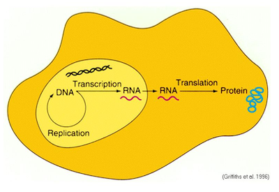
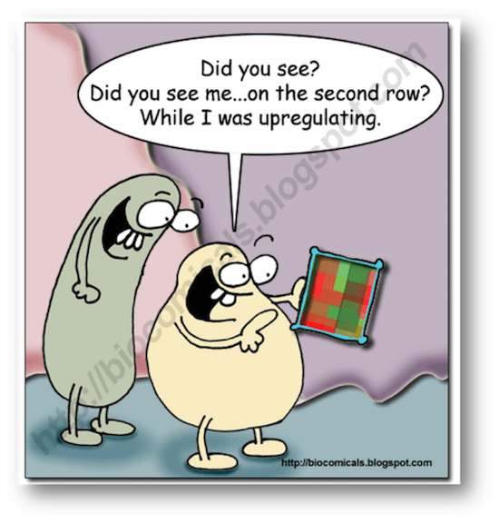

```{r libraries, echo=FALSE, message=FALSE, warning=FALSE}
library(tidyverse)
library(printr)
library(cowplot)
```


## Objectives
- Load microarray dataset into R
- Explore the dataset with basic visualizations
- Identify differentially expressed genes (DEGs)
- Generate annotation of the DEGs (*Tentative*)

<center>

</center>

## The Central Dogma of Biology



## Cleft Lip and Palate 1/3

Cleft lip and cleft palate (**CLP**) are splits in the upper lip, the roof of the mouth (palate) or both. They result when facial structures that are developing in an unborn baby do not close completely. CLP is one of the most common birth defects with a frequency of 1/700 live births.


## Cleft Lip and Palate 2/3

Children with cleft lip with or without cleft palate face a variety of challenges, depending on the type and severity of the cleft.

- **Difficulty feeding.** One of the most immediate concerns after birth is feeding.

- **Ear infections and hearing loss.** Babies with cleft palate are especially at risk of developing middle ear fluid and hearing loss.

- **Dental problems.** If the cleft extends through the upper gum, tooth development may be affected.

- **Speech difficulties.** Because the palate is used in forming sounds, the development of normal speech can be affected by a cleft palate. Speech may sound too nasal.

*Reference*: [Mayo Foundation for Medical Education and Research](https://www.mayoclinic.org/diseases-conditions/cleft-palate/symptoms-causes/syc-20370985)

## Cleft Lip and Palate 3/3

- DNA variation in Interferon Regulatory Factor 6 (**IRF6**) causes Van der Woude syndrome (**VWS**)

- VWS is the most common syndromic form of cleft lip and palate.

- However, the causing variant in IRF6 has been found in *only* 70% of VWS families!

- IRF6 is a **transcription factor** with a conserved helix-loop-helix DNA binding domain and a less well-conserved protein binding domain. 

*Reference*: [Hum Mol Genet. 2014 May 15; 23(10): 2711–2720](http://doi.org/10.1093/hmg/ddt664)

## Question

Given:

1. The pathogenic variant in IRF6 exists in only 70% of the VWS families

2. IRF6 is a transcription factor

How can we identify other genes that might be involved in the remaining 30% of the VWS families?

## Hint

- Usually, genes that are regulated by a transcription factor belong to the same biological process or pathway.

- Therefore, by comparing the gene expression patterns between wild-type (functional) *Irf6* and knockout (non-functional) *Irf6*, it could be possible to identify genes that are regulated (targeted) by *Irf6*.

## Hypothesis

- \(H_O : \mu_{WT} = \mu_{KO}\)

- \(H_A : \mu_{WT} \ne \mu_{KO}\)

- Where \(\mu\) is the *mean* of the gene expression values of a gene.

- **One**-sided or **Two**-sided testing?

```{r sides, echo=FALSE, message=FALSE, fig.height=2}
n = 1e6
cutoff = qnorm(0.05)
mydata = data.frame(x = rnorm(n))
left = mydata %>% filter(x < cutoff)
right = mydata %>% filter(x > -cutoff)
both = mydata %>% filter(x < cutoff | x > -cutoff)

binwidth = 1e-1

p = ggplot()
p = p + geom_histogram(data = mydata, aes(x = x), fill = "gray", binwidth = binwidth)
p = p + geom_histogram(data = left, aes(x = x), fill = "red", binwidth = binwidth)
p = p + labs(x = "", y = "")
p = p + theme_light()
p = p + theme(axis.text.x = element_blank())
p = p + theme(axis.text.y = element_blank())
p = p + theme(panel.grid.major = element_blank(), panel.grid.minor = element_blank())
p1 = p

p = ggplot()
p = p + geom_histogram(data = mydata, aes(x = x), fill = "gray", binwidth = binwidth)
p = p + geom_histogram(data = right, aes(x = x), fill = "blue", binwidth = binwidth)
p = p + labs(x = "", y = "")
p = p + theme_light()
p = p + theme(axis.text.x = element_blank())
p = p + theme(axis.text.y = element_blank())
p = p + theme(panel.grid.major = element_blank(), panel.grid.minor = element_blank())
p2 = p

p = ggplot()
p = p + geom_histogram(data = mydata, aes(x = x), fill = "gray", binwidth = binwidth)
p = p + geom_histogram(data = left, aes(x = x), fill = "red", binwidth = binwidth)
p = p + geom_histogram(data = right, aes(x = x), fill = "blue", binwidth = binwidth)
p = p + labs(x = "", y = "")
p = p + theme_light()
p = p + theme(axis.text.x = element_blank())
p = p + theme(axis.text.y = element_blank())
p = p + theme(panel.grid.major = element_blank(), panel.grid.minor = element_blank())
p3 = p

plot_grid(p1, p2, p3, labels = c("a", "b", "c"), ncol = 3)
```

## Why Microarray?


## Why Microarray?

- No need for candidate genes (or genes of interest)

- One experiment assesses the entire transcriptome

- One experiment generates many hypotheses

- Only small amount of RNA is required (~15–200 ng)


## Original Paper


## Experimental Design

- 3 IRF6 wild-type (+/+) and 3 knockout (-/-) mouse embryos.
- E17.5 embryos were removed from euthanized mothers.
- Skin was removed from embryos.
- Total RNA was isolated from the skin.
- Resultant RNA was hybridized to Affymetrix GeneChip Mouse Genome 430 2.0 arrays.


## Dataset

- The original dataset can be obtained from NCBI GEO with accession [GSE5800](https://www.ncbi.nlm.nih.gov/geo/query/acc.cgi?acc=GSE5800)

```{r dataset, echo=FALSE, message=FALSE, warning=FALSE}
df = read_tsv("https://media.githubusercontent.com/media/ahmedmoustafa/gene-expression-datasets/main/datasets/irf6/irf6.tsv")[1:4,]
head(df)
```


## Loading

First, we are going to load the dataset from the `.tsv` file into `R` as a variable called `data` using the [`read.table`](http://www.inside-r.org/r-doc/utils/read.table) function.

**Note:** `.tsv` stands for [tab-separated values](https://en.wikipedia.org/wiki/Tab-separated_values), which is simply a plain text file. The file itself can downloaded from [here](https://media.githubusercontent.com/media/ahmedmoustafa/gene-expression-datasets/main/datasets/irf6/irf6.tsv).

In the following code, `data` is just an arbitrary **variable** name to hold the result of `read.table`. See here for [**valid** variable names](https://www.datamentor.io/r-programming/variable-constant/) in **R**. Also it is recommended to see here for generally [Good Variable Names](https://wiki.c2.com/?GoodVariableNames).

## Loading

```{r}
# Load the data from a file into a variable
data = read.table("https://media.githubusercontent.com/media/ahmedmoustafa/gene-expression-datasets/main/datasets/irf6/irf6.tsv", header = TRUE, row.names = 1)

# Convert the data.frame (table) in a matrix (numeric)
data = as.matrix(data)
```

**Note:** the hash sign (`#`) indicates that what comes after is a *comment*. Comments are for documentation and readability of the code and they are not evaluated (or executed).

## Checking

```{r}
dim(data) # Dimension of the dataset
head(data) # First few rows
```

## Number of Genes and IDs

```{r}
number_of_genes = nrow(data) # number of genes = number of rows
number_of_genes

ids = row.names(data) # The ids of the genes are the names of the rows
head(ids)
```

## Exploring

Check the behavior of the data (e.g., normal?, skewed?)

```{r}
hist(data, col = "gray", main="Histogram")
```

## Transforming

\(log_2\) transformation (why?)

```{r}
data2 = log2(data)
hist(data2, col = "gray")
```

## Boxplot

```{r}
colors = c(rep("navy", 3), rep("orange", 3))
boxplot(data2, col = colors)
```

## Clustering

Hierarchical clustering of the **samples** (i.e., columns) based on the [correlation coefficients](http://en.wikipedia.org/wiki/Pearson_product-moment_correlation_coefficient) of the expression values

```{r}
hc = hclust(as.dist(1 - cor(data2)))
plot(hc)
```

To learn more about a function (e.g., `hclust`), you may type `?function` (e.g., `?hclust`) in the `console` to launch `R` documentation on that function.

## Splitting Data Matrix into two tables

**KO**

```{r}
ko = data2[, 1:3] # KO matrix
head(ko)
```

## Splitting Data Matrix into two tables

**WT**

```{r}
wt = data2[, 4:6] # WT matrix
head(wt)
```


## Gene (Row) Mean Expression

```{r}
# Compute the means of the KO samples
ko.means = rowMeans(ko)
head(ko.means)

# Compute the means of the WT samples
wt.means = rowMeans(wt)
head(wt.means)

```

## Scatter between the means

```{r}
plot(ko.means ~ wt.means) # The actual scatter plot
abline(0, 1, col = "red") # Only a diagonal line
```


## Differential Gene Expression Analysis


To identify Differentially Expressed Genes (DEGs), we will identify:

- **Biologically** significantly differentially expressed
- **Statistically** significantly differentially expressed

Then, we will take the **overlap** (**intersection**) of the two sets

## Biological Significance (fold-change)

```{r}
fold = ko.means - wt.means # Difference between means
head(fold)
```

- What do the positive and negative values of the fold-change indicate? Considering the `WT` condition is the **reference** (or **control**)

- **+ve** fold-change \(\rightarrow\) **Up**-regulation \(\uparrow\)
- **-ve** fold-change \(\rightarrow\) **Down**-regulation \(\downarrow\)


## Biological Significance (fold-change)

```{r}
hist(fold, col = "gray") # Histogram of the fold
```

## Statistical Significance (*p*-value)

- To assess the statistical significance of the difference in the expression values for each gene between the two conditions (e.g., `WT` and `KO`), we are going to use [*t*-test](http://en.wikipedia.org/wiki/Student%27s_t-test).

```{r echo=FALSE,message=FALSE,warning=FALSE,fig.height=3}
n = 1e6
x = data.frame(Value = rnorm(n, m = 0.1, sd = 1), Condition = "X")
y = data.frame(Value = rnorm(n, m = -0.1, sd = 1), Condition = "Y")
z = x %>% bind_rows(y)
p = ggplot(z)
p = p + geom_density(aes(x = Value, fill = Condition), alpha = 0.5)
p = p + theme_light()
p = p + theme(legend.position = "top")
p1 = p

x = data.frame(Value = rnorm(n, m = 2, sd = 1), Condition = "X")
y = data.frame(Value = rnorm(n, m = -2, sd = 1), Condition = "Y")
z = x %>% bind_rows(y)
p = ggplot(z)
p = p + geom_density(aes(x = Value, fill = Condition), alpha = 0.5)
p = p + theme_light()
p = p + theme(legend.position = "top")
p2 = p

plot_grid(p1, p2, labels = c("a", "b"))

```

## *t*-test

Let's say there are two samples *x* and *y* from the two populations, *X* and *Y*, respectively, to determine whether the means of two populations are significantly different, we can use [`t.test`](https://www.rdocumentation.org/packages/stats/versions/3.6.2/topics/t.test).

## *t*-test : Example 1

```{r}
x = c(4, 3, 10, 7, 9) ; y = c(7, 4, 3, 8, 10)
t.test(x, y)
```

```{r}
t.test(x, y)$p.value
```

## *t*-test : Example 2

```{r}
x = c(6, 8, 10, 7, 9) ; y = c(3, 2, 1, 4, 5)
t.test(x, y)
```

```{r}
t.test(x, y)$p.value
```

Let's compute the *p*-value for all genes using a `for`-loop of `t.test`, one gene at a time:

```{r}
pvalue = NULL # Empty list for the p-values

for(i in 1 : number_of_genes) { # for each gene from to the number of genes
  x = wt[i, ] # wt values of gene number i
  y = ko[i, ] # ko values of gene number i
  t = t.test(x, y) # t-test between the two conditions
  pvalue[i] = t$p.value # Store p-value number i into the list of p-values
}
head(pvalue)
```

```{r}
hist(-log10(pvalue), col = "gray") # Histogram of p-values (-log10)
```

## Volcano
```{r}
plot(-log10(pvalue) ~ fold)
```

```{r eval=FALSE}
fold_cutoff = 2
pvalue_cutoff = 0.01

plot(-log10(pvalue) ~ fold)

abline(v = fold_cutoff, col = "blue", lwd = 3)
abline(v = -fold_cutoff, col = "red", lwd = 3)
abline(h = -log10(pvalue_cutoff), col = "green", lwd = 3)
```

```{r echo=FALSE}
fold_cutoff = 2
pvalue_cutoff = 0.01

plot(-log10(pvalue) ~ fold)

abline(v = fold_cutoff, col = "blue", lwd = 3)
abline(v = -fold_cutoff, col = "red", lwd = 3)
abline(h = -log10(pvalue_cutoff), col = "green", lwd = 3)
```

## Filtering for DEGs

```{r}
filter_by_fold = abs(fold) >= fold_cutoff # Biological
sum(filter_by_fold) # Number of genes staisfy the condition

filter_by_pvalue = pvalue <= pvalue_cutoff # Statistical
sum(filter_by_pvalue)

filter_combined = filter_by_fold & filter_by_pvalue # Combined
sum(filter_combined)
```

```{r}
filtered = data2[filter_combined, ]
dim(filtered)
head(filtered)
```

```{r}
plot(-log10(pvalue) ~ fold)
points(-log10(pvalue[filter_combined]) ~ fold[filter_combined],
       col = "green")
```

## Exercise

On the volcano  plot, highlight the up-regulated genes in red and the download-regulated genes in blue

<details>
  <summary>Click here for the solution</summary>

- Up-regulated genes

```{r}
# Screen for the up-regulated genes (+ve fold)
filter_up = filter_combined & fold > 0

head(filter_up)
```

```{r}
# Number of filtered genes
sum(filter_up)
```

- Down-regulated genes
```{r}
# Screen for the down-regulated genes (-ve fold)
filter_down = filter_combined & fold < 0

head(filter_down)
```

```{r}
# Number of filtered genes
sum(filter_down)
```

```{r}
plot(-log10(pvalue) ~ fold)
points(-log10(pvalue[filter_up]) ~ fold[filter_up], col = "red")
points(-log10(pvalue[filter_down]) ~ fold[filter_down], col = "blue")
```

</details>

## Heatmap

```{r}
heatmap(filtered)
```

## Heatmap


- By default, `heatmap` clusters genes (rows) and samples (columns) based on [the Euclidean distance](http://en.wikipedia.org/wiki/Euclidean_distance).

- In the context of gene expression, we need to cluster genes and samples based on the correlation to explore patterns of **[co-regulation](http://dx.doi.org/10.1186/1471-2105-5-18)** (**co-expression**) - *Guilt by Association*.

- To let `heatmap` cluster the genes and/or samples, the genes and samples will be clustered (grouped) by correlation coefficients (using `cor`) among the genes and samples.

## Heatmap

```{r}
# Clustering of the columns (samples)
col_dendrogram = as.dendrogram(hclust(as.dist(1-cor(filtered))))

# Clustering of the rows (genes)
row_dendrogram = as.dendrogram(hclust(as.dist(1-cor(t(filtered)))))
```

## Heatmap

```{r}
# Heatmap with the rows and columns clustered by correlation coefficients
heatmap(filtered, Rowv=row_dendrogram, Colv=col_dendrogram)
```

## Heatmap

```{r eval=FALSE}
library(gplots) # Load the gplots library
heatmap(filtered, Rowv=row_dendrogram, Colv=col_dendrogram, col = rev(redgreen(1024)))
```

```{r echo=FALSE, message=FALSE}
library(gplots) # Load the gplots library
heatmap(filtered, Rowv=row_dendrogram, Colv=col_dendrogram, col = rev(redgreen(1024)))
```

## Annnotation

To obtain the functional annotation of the differentially expressed genes, we are going first to extract their probe ids:

```{r}
filtered_ids = row.names(filtered) # ids of the filtered DE genes
length(filtered_ids)
head(filtered_ids)
write.table (filtered_ids, "results/filtered_ids.txt", row.names = FALSE, col.names = FALSE, quote = FALSE)
```

## Using DAVID annotation database

We can obtain the annotation online via the [Database for Annotation, Visualization and Integrated Discovery](https://david.ncifcrf.gov/) ([DAVID](https://david.ncifcrf.gov/)) by basically copying and pasting the probe ids to DAVID and running the annotation analysis online.

## Using BioConductor annotation packages

Alternatively, we can generate a comprehensive functional annotation via BioConductor packages [`annaffy`](https://bioconductor.org/packages/release/bioc/html/annaffy.html) and [`mouse4302.db`](https://bioconductor.org/packages/release/data/annotation/html/mouse4302.db.html).

If the packages are not already installed, they can be installed using the following code:

```{r eval=FALSE}
if (!requireNamespace("BiocManager", quietly = TRUE))
    install.packages("BiocManager")

BiocManager::install(c("annaffy", "mouse4302.db"))
```

## Annnotation

Next the annotation can be obtained by loading the library:

```{r warning=FALSE}
library(annaffy)
```

## Annnotation

Then generating and exporting the annotation into HTML format:

```{r warning=FALSE}
annotation_table = aafTableAnn(filtered_ids, "mouse4302.db")
saveHTML(annotation_table, file="results/filtered_annotation.html")
browseURL("results/filtered_annotation.html")
```

## Annnotation

As an HTML file, the [annotation table](https://htmlpreview.github.io/?https://raw.githubusercontent.com/ahmedmoustafa/Notebooks/main/Irf6/results/filtered_annotation.html) can now be opened in any standard browser.

For a further focused functional analysis, let's split the DEGs according to the regulation pattern (up-regulated vs. down-regulated) to determine which functions/pathways/processes turned on or off from WT to KO:

## Up-regulated Genes 

```{r}
filtered_up_ids = ids[filter_up]
length (filtered_up_ids)
write.table (filtered_up_ids, "results/filtered_up_ids.txt", row.names = FALSE, col.names = FALSE, quote = FALSE)
annotation_table = aafTableAnn(filtered_up_ids, "mouse4302.db")
saveHTML(annotation_table, file="results/filtered_up_annotation.html")
browseURL("results/filtered_up_annotation.html")
```

Here is the functional annotation of [the up-regulated genes](https://htmlpreview.github.io/?https://raw.githubusercontent.com/ahmedmoustafa/Notebooks/main/Irf6/results/filtered_up_annotation.html)

## Down-regulated Genes 

```{r}
filtered_down_ids = ids[filter_down]
length (filtered_down_ids)
write.table (filtered_down_ids, "results/filtered_down_ids.txt", row.names = FALSE, col.names = FALSE, quote = FALSE)
annotation_table = aafTableAnn(filtered_down_ids, "mouse4302.db")
saveHTML(annotation_table, file="results/filtered_down_annotation.html")
browseURL("results/filtered_down_annotation.html")
```

Here is the functional annotation of [the down-regulated genes](https://htmlpreview.github.io/?https://raw.githubusercontent.com/ahmedmoustafa/Notebooks/main/Irf6/results/filtered_down_annotation.html)


## Sanity Check (Irf6)


## Sanity Check (Irf6)

```{r echo=FALSE,fig.align="center", fig.width=4, fig.height=3.5}
irf6_id = "1418301_at"
irf6 = filtered[which(rownames(filtered) == irf6_id), ]
boxplot(irf6[1:3], irf6[4:6], col = c("navy", "orange"), names = c("KO", "WT"), main = "")
```

## Multiple Testing Correction

We conducted `r scales::comma(number_of_genes)` statistical tests. The computed *p*-values should be corrected for [**multiple testing**](https://en.wikipedia.org/wiki/Multiple_comparisons_problem). The correction can be performed using `p.adjust`, which simply takes the original *p*-values as a vector and returns the adjusted (corrected) *p*-values using the [False Discovery Rate](https://en.wikipedia.org/wiki/False_discovery_rate) adjustment method:

```{r}
adjusted.pvalues = p.adjust(pvalue, method = "fdr")
```

The number of the **original** *p*-values $\leq$ 0.05 is `r scales::comma(sum(pvalue <= 0.05))` while the number of **adjusted** *p*-values $\leq$ 0.05 is `r scales::comma(sum(adjusted.pvalues <= 0.05))`.

## Multiple Testing Correction

Here is a sample of the original *p*-values and their corresponding adjusted *p*-values:

```{r echo=FALSE}
df = tibble(pvalue = pvalue, adjusted.pvalue = adjusted.pvalues)
head(df)
```

## Multiple Testing Correction

And here is the overall relationship between the original and the adjusted p-values:

```{r original-vs-adjusted, echo=FALSE}
p = ggplot(df) + geom_jitter(aes(x = -log10(pvalue), y = -log10(adjusted.pvalue))) + theme_light()
ggExtra::ggMarginal(p, type = "density", fill = "black", alpha = 0.5)
```

**Note:** Formally, we *should* have performed all *p*-value-based analyses (filtering and downstream steps) based on the adjusted *p*-values, but for the sake of simplicity, we proceeded with the original *p*-values instead of the adjusted *p*-values.

## Thank you!


