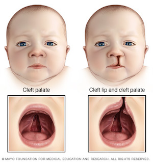
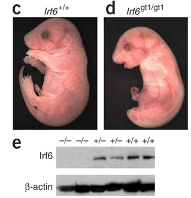

Microarray Gene Expression Analysis with R
================

## Objectives

-   Load microarray dataset into R
-   Explore the dataset with basic visualizations
-   Identify differentially expressed genes (DEGs)
-   Generate annotation of the DEGs (*Tentative*)

<center>

</center>

## The Central Dogma of Biology


## Cleft Lip and Palate 1/3

Cleft lip and cleft palate (**CLP**) are splits in the upper lip, the
roof of the mouth (palate) or both. They result when facial structures
that are developing in an unborn baby do not close completely. CLP is
one of the most common birth defects with a frequency of 1/700 live
births.



## Cleft Lip and Palate 2/3

Children with cleft lip with or without cleft palate face a variety of
challenges, depending on the type and severity of the cleft.

-   **Difficulty feeding.** One of the most immediate concerns after
    birth is feeding.

-   **Ear infections and hearing loss.** Babies with cleft palate are
    especially at risk of developing middle ear fluid and hearing loss.

-   **Dental problems.** If the cleft extends through the upper gum,
    tooth development may be affected.

-   **Speech difficulties.** Because the palate is used in forming
    sounds, the development of normal speech can be affected by a cleft
    palate. Speech may sound too nasal.

*Reference*: [Mayo Foundation for Medical Education and
Research](https://www.mayoclinic.org/diseases-conditions/cleft-palate/symptoms-causes/syc-20370985)

## Cleft Lip and Palate 3/3

-   DNA variation in Interferon Regulatory Factor 6 (**IRF6**) causes
    Van der Woude syndrome (**VWS**)

-   VWS is the most common syndromic form of cleft lip and palate.

-   However, the causing variant in IRF6 has been found in *only* 70% of
    VWS families!

-   IRF6 is a **transcription factor** with a conserved helix-loop-helix
    DNA binding domain and a less well-conserved protein binding domain.

*Reference*: [Hum Mol Genet. 2014 May 15; 23(10):
2711–2720](http://doi.org/10.1093/hmg/ddt664)

## Question

Given:

1.  The pathogenic variant in IRF6 exists in only 70% of the VWS
    families

2.  IRF6 is a transcription factor

How can we identify other genes that might be involved in the remaining
30% of the VWS families?

## Hint

-   Usually, genes that are regulated by a transcription factor belong
    to the same biological process or pathway.

-   Therefore, by comparing the gene expression patterns between
    wild-type (functional) *Irf6* and knockout (non-functional) *Irf6*,
    it could be possible to identify genes that are regulated (targeted)
    by *Irf6*.

## Hypothesis

-   *H*<sub>*O*</sub> : *μ*<sub>*W**T*</sub> = *μ*<sub>*K**O*</sub>

-   *H*<sub>*A*</sub> : *μ*<sub>*W**T*</sub> ≠ *μ*<sub>*K**O*</sub>

-   Where *μ* is the *mean* of the gene expression values of a gene.

-   **One**-sided or **Two**-sided testing?

<!-- -->

## Why Microarray?


## Why Microarray?

-   No need for candidate genes (or genes of interest)

-   One experiment assesses the entire transcriptome

-   One experiment generates many hypotheses

-   Only small amount of RNA is required (\~15–200 ng)


## Original Paper


## Experimental Design

-   3 IRF6 wild-type (+/+) and 3 knockout (-/-) mouse embryos.
-   E17.5 embryos were removed from euthanized mothers.
-   Skin was removed from embryos.
-   Total RNA was isolated from the skin.
-   Resultant RNA was hybridized to Affymetrix GeneChip Mouse Genome 430
    2.0 arrays.



## Dataset

-   The original dataset can be obtained from NCBI GEO with accession
    [GSE5800](https://www.ncbi.nlm.nih.gov/geo/query/acc.cgi?acc=GSE5800)

| ID         |     KO1 |     KO2 |     KO3 |     WT1 |     WT2 |     WT3 |
|:-----------|--------:|--------:|--------:|--------:|--------:|--------:|
| 1415670_at |  6531.0 |  5562.8 |  6822.4 |  7732.1 |  7191.2 |  7551.9 |
| 1415671_at | 11486.3 | 10542.7 | 10641.4 | 10408.2 |  9484.5 |  7650.2 |
| 1415672_at | 14339.2 | 13526.1 | 14444.7 | 12936.6 | 13841.7 | 13285.7 |
| 1415673_at |  3156.8 |  2219.5 |  3264.4 |  2374.2 |  2201.8 |  2525.3 |

## Loading

First, we are going to load the dataset from the `.tsv` file into `R` as
a variable called `data` using the
[`read.table`](http://www.inside-r.org/r-doc/utils/read.table) function.
<br> `data` is just an arbitrary **variable** name to hold the result of
`read.table` and it can be called/named *almost* anything.

``` r
# Load the data from a file into a variable
data = read.table("https://media.githubusercontent.com/media/ahmedmoustafa/gene-expression-datasets/main/datasets/irf6/irf6.tsv", header = TRUE, row.names = 1)

# Convert the data.frame (table) in a matrix (numeric)
data = as.matrix(data)
```

**Note:** the hash sign (`#`) indicates that what comes after is a
*comment*. Comments are for documentation and readability of the `R`
code and they are not evaluated (or executed).

## Checking

``` r
dim(data) # Dimension of the dataset
```

    ## [1] 45101     6

``` r
head(data) # First few rows
```

|               |     KO1 |     KO2 |     KO3 |     WT1 |     WT2 |     WT3 |
|:--------------|--------:|--------:|--------:|--------:|--------:|--------:|
| 1415670_at    |  6531.0 |  5562.8 |  6822.4 |  7732.1 |  7191.2 |  7551.9 |
| 1415671_at    | 11486.3 | 10542.7 | 10641.4 | 10408.2 |  9484.5 |  7650.2 |
| 1415672_at    | 14339.2 | 13526.1 | 14444.7 | 12936.6 | 13841.7 | 13285.7 |
| 1415673_at    |  3156.8 |  2219.5 |  3264.4 |  2374.2 |  2201.8 |  2525.3 |
| 1415674_a\_at |  4002.0 |  3306.9 |  3777.0 |  3760.6 |  3137.0 |  2911.5 |
| 1415675_at    |  3468.4 |  3347.4 |  3332.9 |  3073.5 |  3046.0 |  2914.4 |

## Number of Genes and IDs

``` r
number_of_genes = nrow(data) # number of genes = number of rows
number_of_genes
```

    ## [1] 45101

``` r
ids = row.names(data) # The ids of the genes are the names of the rows
head(ids)
```

    ## [1] "1415670_at"   "1415671_at"   "1415672_at"   "1415673_at"   "1415674_a_at"
    ## [6] "1415675_at"

## Exploring

Check the behavior of the data (e.g., normal?, skewed?)

``` r
hist(data, col = "gray", main="Histogram")
```

<!-- -->

## Transforming

*l**o**g*<sub>2</sub> transformation (why?)

``` r
data2 = log2(data)
hist(data2, col = "gray")
```

<!-- -->

## Boxplot

``` r
colors = c(rep("navy", 3), rep("orange", 3))
boxplot(data2, col = colors)
```

<!-- -->

## Clustering 1/2

Hierarchical clustering of the **samples** (i.e., columns) based on the
[correlation
coefficients](http://en.wikipedia.org/wiki/Pearson_product-moment_correlation_coefficient)
of the expression values

``` r
hc = hclust(as.dist(1 - cor(data2)))
plot(hc)
```

<!-- -->

## Clustering 2/2

To learn more about a function (e.g., `hclust`), you may type
`?function` (e.g., `?hclust`) in the `console` to launch `R`
documentation on that function:

## Splitting Data Matrix into Two 1/2

``` r
ko = data2[, 1:3] # KO matrix
head(ko)
```

|               |      KO1 |      KO2 |      KO3 |
|:--------------|---------:|---------:|---------:|
| 1415670_at    | 12.67309 | 12.44160 | 12.73606 |
| 1415671_at    | 13.48763 | 13.36396 | 13.37740 |
| 1415672_at    | 13.80768 | 13.72346 | 13.81825 |
| 1415673_at    | 11.62425 | 11.11602 | 11.67260 |
| 1415674_a\_at | 11.96651 | 11.69126 | 11.88303 |
| 1415675_at    | 11.76005 | 11.70883 | 11.70256 |

## Splitting Data Matrix into Two 2/2

``` r
wt = data2[, 4:6] # WT matrix
head(wt)
```

|               |      WT1 |      WT2 |      WT3 |
|:--------------|---------:|---------:|---------:|
| 1415670_at    | 12.91664 | 12.81202 | 12.88262 |
| 1415671_at    | 13.34543 | 13.21136 | 12.90128 |
| 1415672_at    | 13.65917 | 13.75673 | 13.69759 |
| 1415673_at    | 11.21323 | 11.10447 | 11.30224 |
| 1415674_a\_at | 11.87675 | 11.61517 | 11.50755 |
| 1415675_at    | 11.58567 | 11.57270 | 11.50898 |

## Gene (Row) Mean Expression

``` r
# Compute the means of the KO samples
ko.means = rowMeans(ko)
head(ko.means)
```

    ##   1415670_at   1415671_at   1415672_at   1415673_at 1415674_a_at   1415675_at 
    ##     12.61692     13.40966     13.78313     11.47096     11.84693     11.72381

``` r
# Compute the means of the WT samples
wt.means = rowMeans(wt)
head(wt.means)
```

    ##   1415670_at   1415671_at   1415672_at   1415673_at 1415674_a_at   1415675_at 
    ##     12.87043     13.15269     13.70450     11.20664     11.66649     11.55578

## Scatter 1/2

``` r
plot(ko.means ~ wt.means) # The actual scatter plot
abline(0, 1, col = "red") # Only a diagonal line
```

<!-- -->

## Scatter 2/2

``` r
pairs(data2) # All pairwise comparisons
```

<!-- -->

## Differentially Expressed Genes (DEGs)

To identify DEGs, we will identify:

-   **Biologically** significantly differentially expressed
-   **Statistically** significantly differentially expressed

Then, we will take the **overlap** (**intersection**) of the two sets


## Biological Significance (fold-change) 1/2

``` r
fold = ko.means - wt.means # Difference between means
head(fold)
```

    ##   1415670_at   1415671_at   1415672_at   1415673_at 1415674_a_at   1415675_at 
    ##  -0.25351267   0.25697097   0.07863227   0.26431191   0.18044345   0.16803065

-   What do the positive and negative values of the fold-change
    indicate? Considering the `WT` condition is the **reference** (or
    **control**)

-   **+ve** fold-change → **Up**-regulation ↑

-   **-ve** fold-change → **Down**-regulation ↓

## Biological Significance (fold-change) 2/2

``` r
hist(fold, col = "gray") # Histogram of the fold
```

<!-- -->

## Statistical Significance (*p*-value) 1/3

-   To assess the statistical significance of the difference in the
    expression values for each gene between the two conditions (e.g.,
    `WT` and `KO`), we are going to use
    [*t*-test](http://en.wikipedia.org/wiki/Student%27s_t-test).

<!-- -->

## *t*-test

Let’s say there are two samples *x* and *y* from the two populations,
*X* and *Y*, respectively, to determine whether the means of two
populations are significantly different, we can use `t.test`.

``` r
?t.test
```

    ## Student's t-Test
    ## 
    ## Description:
    ## 
    ##      Performs one and two sample t-tests on vectors of data.
    ## 
    ## Usage:
    ## 
    ##      t.test(x, ...)
    ##      
    ##      ## Default S3 method:
    ##      t.test(x, y = NULL,
    ##             alternative = c("two.sided", "less", "greater"),
    ##             mu = 0, paired = FALSE, var.equal = FALSE,
    ##             conf.level = 0.95, ...)
    ##      
    ##      ## S3 method for class 'formula'
    ##      t.test(formula, data, subset, na.action, ...)
    ##      
    ## Arguments:
    ## 
    ##        x: a (non-empty) numeric vector of data values.
    ## 
    ##        y: an optional (non-empty) numeric vector of data values.
    ## 
    ## alternative: a character string specifying the alternative hypothesis,
    ##           must be one of '"two.sided"' (default), '"greater"' or
    ##           '"less"'.  You can specify just the initial letter.
    ## 
    ##       mu: a number indicating the true value of the mean (or difference
    ##           in means if you are performing a two sample test).
    ## 
    ##   paired: a logical indicating whether you want a paired t-test.
    ## 
    ## var.equal: a logical variable indicating whether to treat the two
    ##           variances as being equal. If 'TRUE' then the pooled variance
    ##           is used to estimate the variance otherwise the Welch (or
    ##           Satterthwaite) approximation to the degrees of freedom is
    ##           used.
    ## 
    ## conf.level: confidence level of the interval.
    ## 
    ##  formula: a formula of the form 'lhs ~ rhs' where 'lhs' is a numeric
    ##           variable giving the data values and 'rhs' either '1' for a
    ##           one-sample or paired test or a factor with two levels giving
    ##           the corresponding groups. If 'lhs' is of class '"Pair"' and
    ##           'rhs' is '1', a paired test is done
    ## 
    ##     data: an optional matrix or data frame (or similar: see
    ##           'model.frame') containing the variables in the formula
    ##           'formula'.  By default the variables are taken from
    ##           'environment(formula)'.
    ## 
    ##   subset: an optional vector specifying a subset of observations to be
    ##           used.
    ## 
    ## na.action: a function which indicates what should happen when the data
    ##           contain 'NA's.  Defaults to 'getOption("na.action")'.
    ## 
    ##      ...: further arguments to be passed to or from methods.
    ## 
    ## Details:
    ## 
    ##      'alternative = "greater"' is the alternative that 'x' has a larger
    ##      mean than 'y'. For the one-sample case: that the mean is positive.
    ## 
    ##      If 'paired' is 'TRUE' then both 'x' and 'y' must be specified and
    ##      they must be the same length.  Missing values are silently removed
    ##      (in pairs if 'paired' is 'TRUE').  If 'var.equal' is 'TRUE' then
    ##      the pooled estimate of the variance is used.  By default, if
    ##      'var.equal' is 'FALSE' then the variance is estimated separately
    ##      for both groups and the Welch modification to the degrees of
    ##      freedom is used.
    ## 
    ##      If the input data are effectively constant (compared to the larger
    ##      of the two means) an error is generated.
    ## 
    ## Value:
    ## 
    ##      A list with class '"htest"' containing the following components:
    ## 
    ## statistic: the value of the t-statistic.
    ## 
    ## parameter: the degrees of freedom for the t-statistic.
    ## 
    ##  p.value: the p-value for the test.
    ## 
    ## conf.int: a confidence interval for the mean appropriate to the
    ##           specified alternative hypothesis.
    ## 
    ## estimate: the estimated mean or difference in means depending on
    ##           whether it was a one-sample test or a two-sample test.
    ## 
    ## null.value: the specified hypothesized value of the mean or mean
    ##           difference depending on whether it was a one-sample test or a
    ##           two-sample test.
    ## 
    ##   stderr: the standard error of the mean (difference), used as
    ##           denominator in the t-statistic formula.
    ## 
    ## alternative: a character string describing the alternative hypothesis.
    ## 
    ##   method: a character string indicating what type of t-test was
    ##           performed.
    ## 
    ## data.name: a character string giving the name(s) of the data.
    ## 
    ## See Also:
    ## 
    ##      'prop.test'
    ## 
    ## Examples:
    ## 
    ##      require(graphics)
    ##      
    ##      t.test(1:10, y = c(7:20))      # P = .00001855
    ##      t.test(1:10, y = c(7:20, 200)) # P = .1245    -- NOT significant anymore
    ##      
    ##      ## Classical example: Student's sleep data
    ##      plot(extra ~ group, data = sleep)
    ##      ## Traditional interface
    ##      with(sleep, t.test(extra[group == 1], extra[group == 2]))
    ##      
    ##      ## Formula interface
    ##      t.test(extra ~ group, data = sleep)
    ##      
    ##      ## Formula interface to one-sample test
    ##      t.test(extra ~ 1, data = sleep)
    ##      
    ##      ## Formula interface to paired test
    ##      ## The sleep data are actually paired, so could have been in wide format:
    ##      sleep2 <- reshape(sleep, direction = "wide", 
    ##                        idvar = "ID", timevar = "group")
    ##      t.test(Pair(extra.1, extra.2) ~ 1, data = sleep2)

## *t*-test : Example 1

``` r
x = c(4, 3, 10, 7, 9) ; y = c(7, 4, 3, 8, 10)
t.test(x, y)
```

    ## 
    ##  Welch Two Sample t-test
    ## 
    ## data:  x and y
    ## t = 0.1066, df = 7.9743, p-value = 0.9177
    ## alternative hypothesis: true difference in means is not equal to 0
    ## 95 percent confidence interval:
    ##  -4.12888  4.52888
    ## sample estimates:
    ## mean of x mean of y 
    ##       6.6       6.4

``` r
t.test(x, y)$p.value
```

    ## [1] 0.917739

## *t*-test : Example 2

``` r
x = c(6, 8, 10, 7, 9) ; y = c(3, 2, 1, 4, 5)
t.test(x, y)
```

    ## 
    ##  Welch Two Sample t-test
    ## 
    ## data:  x and y
    ## t = 5, df = 8, p-value = 0.001053
    ## alternative hypothesis: true difference in means is not equal to 0
    ## 95 percent confidence interval:
    ##  2.693996 7.306004
    ## sample estimates:
    ## mean of x mean of y 
    ##         8         3

``` r
t.test(x, y)$p.value
```

    ## [1] 0.001052826

## Statistical Significance (*p*-value) 2/3

Let’s compute the *p*-value for all genes using a `for`-loop of
`t.test`, one gene at a time:

``` r
pvalue = NULL # Empty list for the p-values

for(i in 1 : number_of_genes) { # for each gene from to the number of genes
  x = wt[i, ] # wt values of gene number i
  y = ko[i, ] # ko values of gene number i
  t = t.test(x, y) # t-test between the two conditions
  pvalue[i] = t$p.value # Store p-value number i into the list of p-values
}
head(pvalue)
```

    ## [1] 0.092706280 0.182663337 0.129779075 0.272899180 0.262377176 0.005947807

## Statistical Significance (*p*-value) 3/3

``` r
hist(-log10(pvalue), col = "gray") # Histogram of p-values (-log10)
```

<!-- -->

## Volcano : Statistical & Biological 1/3

``` r
plot(-log10(pvalue) ~ fold)
```

<!-- -->

## Volcano : Statistical & Biological 2/3

``` r
fold_cutoff = 2
pvalue_cutoff = 0.01

plot(-log10(pvalue) ~ fold)

abline(v = fold_cutoff, col = "blue", lwd = 3)
abline(v = -fold_cutoff, col = "red", lwd = 3)
abline(h = -log10(pvalue_cutoff), col = "green", lwd = 3)
```

## Volcano : Statistical & Biological 3/3

<!-- -->

## Filtering for DEGs 1/3

``` r
filter_by_fold = abs(fold) >= fold_cutoff # Biological
sum(filter_by_fold) # Number of genes staisfy the condition
```

    ## [1] 1051

``` r
filter_by_pvalue = pvalue <= pvalue_cutoff # Statistical
sum(filter_by_pvalue)
```

    ## [1] 1564

``` r
filter_combined = filter_by_fold & filter_by_pvalue # Combined
sum(filter_combined)
```

    ## [1] 276

## Filtering for DEGs 2/3

``` r
filtered = data2[filter_combined, ]
dim(filtered)
```

    ## [1] 276   6

``` r
head(filtered)
```

|               |       KO1 |       KO2 |       KO3 |      WT1 |       WT2 |       WT3 |
|:--------------|----------:|----------:|----------:|---------:|----------:|----------:|
| 1416200_at    | 13.312004 | 12.973357 | 12.868456 |  7.40429 |  8.558803 |  8.683696 |
| 1416236_a\_at | 14.148397 | 14.039236 | 14.130007 | 12.23604 | 12.022403 | 11.495055 |
| 1417808_at    |  5.321928 |  5.442944 |  4.053111 | 15.16978 | 15.070087 | 14.753274 |
| 1417932_at    | 10.602884 | 10.257152 | 10.496055 | 13.98445 | 14.203295 | 13.720960 |
| 1418050_at    | 10.622052 | 10.975490 | 10.795066 | 12.86513 | 13.012048 | 12.658122 |
| 1418100_at    |  9.117903 |  8.634811 |  9.057721 | 12.90358 | 12.842449 | 12.233769 |

## Filtering for DEGs 3/3

``` r
plot(-log10(pvalue) ~ fold)
points(-log10(pvalue[filter_combined]) ~ fold[filter_combined],
       col = "green")
```

<!-- -->

## Exercise #1

On the volcano plot, highlight the up-regulated genes in red and the
download-regulated genes in blue

## Heatmap 1/5

``` r
heatmap(filtered)
```

<!-- -->

## Heatmap 2/5

-   By default, `heatmap` clusters genes (rows) and samples (columns)
    based on [the Euclidean
    distance](http://en.wikipedia.org/wiki/Euclidean_distance).

-   In the context of gene expression, we need to cluster genes and
    samples based on the correlation to explore patterns of
    **[co-regulation](http://dx.doi.org/10.1186/1471-2105-5-18)**
    (**co-expression**) - *Guilt by Association*.

-   To let `heatmap` cluster the genes and/or samples, the genes and
    samples will be clustered (grouped) by correlation coefficients
    (using `cor`) among the genes and samples.

## Heatmap 3/5

``` r
# Clustering of the columns (samples)
col_dendrogram = as.dendrogram(hclust(as.dist(1-cor(filtered))))

# Clustering of the rows (genes)
row_dendrogram = as.dendrogram(hclust(as.dist(1-cor(t(filtered)))))
```


## Heatmap 4/5

``` r
# Heatmap with the rows and columns clustered by correlation coefficients
heatmap(filtered, Rowv=row_dendrogram, Colv=col_dendrogram)
```

<!-- -->

## Heatmap 5/5

``` r
library(gplots) # Load the gplots library
heatmap(filtered, Rowv=row_dendrogram, Colv=col_dendrogram, col = rev(redgreen(1024)))
```

<!-- -->

## Annnotation 1/3

To obtain the functional annotation of the differentially expressed
genes, we are going first to extract their probe ids:

``` r
filterd_ids = row.names(filtered) # ids of the filtered DE genes
length(filterd_ids)
```

    ## [1] 276

``` r
head(filterd_ids)
```

    ## [1] "1416200_at"   "1416236_a_at" "1417808_at"   "1417932_at"   "1418050_at"  
    ## [6] "1418100_at"

## Exercise #2

What are expression values of the gene with id `1418301_at`? Is that
expected? Why or why not?
