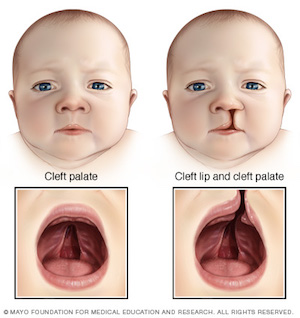
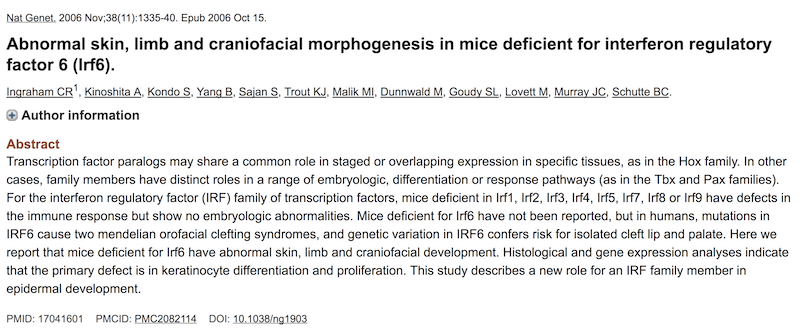
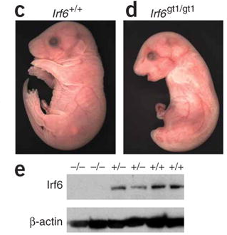
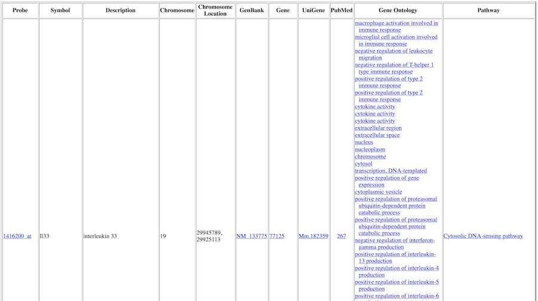

[](images/AUC.png)

```{r libraries, echo=FALSE, message=FALSE, warning=FALSE}
library(readr)
library(printr)
library(dplyr)
library(ggplot2)
library(cowplot)
```

## Today's Objectives
- Download and load microarray dataset into R
- Explore the dataset with basic visualizations
- Identify differentially expressed genes (DEGs)
- Generate annotation of the DEGs


<center>

</center>


## Cleft Lip and Palate 1/3

Cleft lip and cleft palate (**CLP**) are splits in the upper lip, the roof of the mouth (palate) or both. They result when facial structures that are developing in an unborn baby do not close completely. CLP is one of the most common birth defects with a frequency of 1/700 live births.



## Cleft Lip and Palate 2/3

Children with cleft lip with or without cleft palate face a variety of challenges, depending on the type and severity of the cleft.

- **Difficulty feeding.** One of the most immediate concerns after birth is feeding.

- **Ear infections and hearing loss.** Babies with cleft palate are especially at risk of developing middle ear fluid and hearing loss.

- **Dental problems.** If the cleft extends through the upper gum, tooth development may be affected.

- **Speech difficulties.** Because the palate is used in forming sounds, the development of normal speech can be affected by a cleft palate. Speech may sound too nasal.

*Reference*: [Mayo Foundation for Medical Education and Research](https://www.mayoclinic.org/diseases-conditions/cleft-palate/symptoms-causes/syc-20370985)

## Cleft Lip and Palate 3/3

- DNA variation in Interferon Regulatory Factor 6 (**IRF6**) causes Van der Woude syndrome (**VWS**)

- VWS is the most common syndromic form of cleft lip and palate.

- However, the causing variant in IRF6 has been found in *only* 70% of VWS families!

- IRF6 is a **transcription factor** with a conserved helix-loop-helix DNA binding domain and a less well-conserved protein binding domain. 

*Reference*: [Hum Mol Genet. 2014 May 15; 23(10): 2711–2720](http://doi.org/10.1093/hmg/ddt664)

## Question

Given:

1. The pathogenic variant in IRF6 exists in only 70% of the VWS families

2. IRF6 is a transcription factor

How can we identify other genes that might be involved in the remaining 30% of the VWS families?

## Hint

- Usually, genes that are regulated by a transcription factor belong to the same biological process or pathway.

- Therefore, by comparing the gene expression patterns between wild-type (functional) *Irf6* and knockout (non-functional) *Irf6*, it could be possible to identify genes that are regulated (targeted) by *Irf6*.

## Hypothesis

- \(H_O : \mu_{WT} = \mu_{KO}\)

- \(H_A : \mu_{WT} \ne \mu_{KO}\)

- Where \(\mu\) is the *mean* of the gene expression values of a gene.

- **One**-sided or **Two**-sided testing?

```{r sides, echo=FALSE, message=FALSE, fig.height=2}
n = 1e6
cutoff = qnorm(0.05)
mydata = data.frame(x = rnorm(n))
left = mydata %>% filter(x < cutoff)
right = mydata %>% filter(x > -cutoff)
both = mydata %>% filter(x < cutoff | x > -cutoff)

binwidth = 1e-1

p = ggplot()
p = p + geom_histogram(data = mydata, aes(x = x), fill = "gray", binwidth = binwidth)
p = p + geom_histogram(data = left, aes(x = x), fill = "red", binwidth = binwidth)
p = p + labs(x = "", y = "")
p = p + theme_light()
p = p + theme(axis.text.x = element_blank())
p = p + theme(axis.text.y = element_blank())
p = p + theme(panel.grid.major = element_blank(), panel.grid.minor = element_blank())
p1 = p

p = ggplot()
p = p + geom_histogram(data = mydata, aes(x = x), fill = "gray", binwidth = binwidth)
p = p + geom_histogram(data = right, aes(x = x), fill = "blue", binwidth = binwidth)
p = p + labs(x = "", y = "")
p = p + theme_light()
p = p + theme(axis.text.x = element_blank())
p = p + theme(axis.text.y = element_blank())
p = p + theme(panel.grid.major = element_blank(), panel.grid.minor = element_blank())
p2 = p

p = ggplot()
p = p + geom_histogram(data = mydata, aes(x = x), fill = "gray", binwidth = binwidth)
p = p + geom_histogram(data = left, aes(x = x), fill = "red", binwidth = binwidth)
p = p + geom_histogram(data = right, aes(x = x), fill = "blue", binwidth = binwidth)
p = p + labs(x = "", y = "")
p = p + theme_light()
p = p + theme(axis.text.x = element_blank())
p = p + theme(axis.text.y = element_blank())
p = p + theme(panel.grid.major = element_blank(), panel.grid.minor = element_blank())
p3 = p

plot_grid(p1, p2, p3, labels = c("a", "b", "c"), ncol = 3)
```

## Why Microarray?

- It does not require a predefinied set of candidate genes

- It requires only a small amount of RNA

- It is a high-throughput protocol - transcriptome-wide analysis

- One experiment can generate multiple hypotheses

## Original Paper



## Experimental Design

- 3 IRF6 wild-type (+/+) and 3 knockout (-/-) mouse embryos.
- E17.5 embryos were removed from euthanized mothers.
- Skin was removed from embryos.
- Total RNA was isolated from the skin.
- Resultant RNA was hybridized to Affymetrix GeneChip Mouse Genome 430 2.0 arrays.



## Dataset

- The original dataset can be obtained from NCBI GEO with accession [GSE5800](https://www.ncbi.nlm.nih.gov/geo/query/acc.cgi?acc=GSE5800)

```{r dataset, echo=FALSE, message=FALSE, warning=FALSE}
df = read_tsv("data/Irf6.tsv")[1:4,]
head(df)
```

- Download the dataset from the following link [**https://goo.gl/gH7QLM**](https://goo.gl/gH7QLM)


## Loading
We are going to load the dataset from a tsv file (`Irf6.tsv`) into a variable called `data` using function [`read.table`](http://www.inside-r.org/r-doc/utils/read.table).
<br>
<br>
`data` here is just an arbitrary **varilable** name to hold the result of `read.table` and it can be called/named *almost* anything. See [The State of Naming Conventions in R](http://journal.r-project.org/archive/2012-2/RJournal_2012-2_Baaaath.pdf) (Bååth 2012) for more information on naming **varilables** in `R`.

```{r}
# Load data from text file into a varilable
data = as.matrix(read.table("Irf6.tsv", header = TRUE, row.names = 1))
```

**Note:** the hash sign (`#`) indicates that what comes after is a *comment*. Comments are for documentation and readability of the `R` code and they are not evaluated (or executed).

## Checking

```{r}
dim(data) # Dimension of the dataset
head(data) # First few rows
```

## Exploring
Check the behavior of the data (e.g., normal?, skewed?)

```{r}
hist(data, col = "gray", main="Histogram")
```

## Transforming

\(log_2\) transformation (why?)

```{r}
data2 = log2(data)
hist(data2, col = "gray", main="Histogram")
```

## Multiple Plots 1/2
```{r}
samples = colnames(data2) # Headers (names) of the columns
samples
```

```{r eval=FALSE}
par( mfrow = c( 2, 3 ) ) # Split screen into 2 rows x 3 columns paritions

for (i in 1:3) {
  # for each of the first 3 columns in the table
  hist(data2[,i], col = "red", main = samples[i])
}

for (i in 4:6) {
  # for each of the last 3 columns in the table
  hist(data2[,i], col = "green", main = samples[i])
}
```

## Multiple Plots 2/2
```{r echo=FALSE}
par( mfrow = c( 2, 3 ) ) # Split screen into 2 rows x 3 columns paritions

for (i in 1:3) {
  # for each of the first 3 columns in the table
  hist(data2[,i], col = "darkgreen", main = samples[i])
}

for (i in 4:6) {
  # for each of the last 3 columns in the table
  hist(data2[,i], col = "orange", main = samples[i])
}
```

```{r}
par( mfrow = c( 1, 1 ) ) # Just to set screen back to 1 partition
```

## Boxplot

```{r}
colors = c(rep("red", 3), rep("green", 3))
boxplot(data2, col = colors, las = 2)
```

## Clustering 1/2

Hierarchical clustering of the **samples** (i.e., columns) based on the [correlation coefficients](http://en.wikipedia.org/wiki/Pearson_product-moment_correlation_coefficient) of the expression values

```{r}
hc = hclust(as.dist(1 - cor(data2)))
plot(hc)
```

## Clustering 2/2
To learn about a function (e.g., `hclust`), you may type `?function` (e.g., `?hclust`) in the `console` to launch `R` documentation on that function:

## Comparing

We are going to compare the **means** of the replicates of the two conditions

```{r}
# Compute the means of the samples of each condition
ko = apply(data2[, 1:3], 1, mean)
head(ko)

wt = apply(data2[, 4:6], 1, mean)
head(wt)
```


## Scatter 1/2
```{r echo=FALSE}
plot(ko ~ wt)
abline(0, 1, col = "red") # Diagonal line
```

## Scatter 2/2
```{r}
pairs(data2) # All pairwise comparisons
```

## Differentially Expressed Genes (DEGs)

To identify DEGs, we will identify:

- **Biologically** significantly differentially expressed
- **Statistically** significantly differentially expressed

Then, we will take the **overlap** (**intersection**) of the two sets

## Biological Significance (fold-change) 1/2
```{r}
fold = ko - wt # Difference between means
head(fold)
```

- What do the positive and negative values of the fold-change indicate? Considering the `WT` condition is the **reference** (or **control**)

> - **+ve** \(\rightarrow\) **Up**-regulation \(\uparrow\)
> - **-ve** \(\rightarrow\) **Down**-regulation \(\downarrow\)

## Biological Significance (fold-change) 2/2
```{r}
hist(fold, col = "gray") # Histogram of the fold
```

## Statistical Significance (*p*-value) 1/3
- To assess the statistical significance of the difference in the expression values for each gene between the two conditions (e.g., `WT` and `KO`), we are going to use [*t*-test](http://en.wikipedia.org/wiki/Student%27s_t-test).

```{r echo=FALSE,message=FALSE,warning=FALSE,fig.height=3}
n = 1e6
x = data.frame(Value = rnorm(n, m = 0.5, sd = 1), Pop = "X")
y = data.frame(Value = rnorm(n, m = -0.5, sd = 1), Pop = "Y")
z = x %>% bind_rows(y)
p = ggplot(z)
p = p + geom_density(aes(x = Value, fill = Pop), alpha = 0.5)
p = p + theme_light()
p = p + theme(legend.position = "top")
p1 = p

x = data.frame(Value = rnorm(n, m = 2, sd = 1), Pop = "X")
y = data.frame(Value = rnorm(n, m = -2, sd = 1), Pop = "Y")
z = x %>% bind_rows(y)
p = ggplot(z)
p = p + geom_density(aes(x = Value, fill = Pop), alpha = 0.5)
p = p + theme_light()
p = p + theme(legend.position = "top")
p2 = p

plot_grid(p1, p2, labels = c("a", "b"))

```

## *t*-test

Let's say there are two samples *x* and *y* from the two populations, *X* and *Y*, respectively, to determine whether the means of two populations are significantly different, we can use `t.test`.

```{r}
?t.test
```

## *t*-test : Example 1

```{r}
x = c(4, 3, 10, 7, 9) ; y = c(7, 4, 3, 8, 10)
t.test(x, y)
```

```{r}
t.test(x, y)$p.value
```

## *t*-test : Example 2

```{r}
x = c(6, 8, 10, 7, 9) ; y = c(3, 2, 1, 4, 5)
t.test(x, y)
```

```{r}
t.test(x, y)$p.value
```

## Statistical Significance (*p*-value) 2/3
```{r}
pvalue = NULL # Empty list for the p-values
n = nrow(data) # Number of genes (rows)
n
for(i in 1 : n) {
  # for each gene
  x = data2[i, 1:3] # wt values of gene number i
  y = data2[i, 4:6] # ko values of gene number i
  t = t.test(x, y) # t-test between the two conditions
  pvalue[i] = t$p.value # Put current p-value in the list of p-values
}
head(pvalue)
```

## Statistical Significance (*p*-value) 3/3
```{r}
hist(-log10(pvalue), col = "gray") # Histogram of p-values (-log10)
```

## Volcano : Statistical & Biological 1/3
```{r}
plot(-log10(pvalue) ~ fold)
```

## Volcano : Statistical & Biological 2/3
```{r eval=FALSE}
fold_cutoff = 2
pvalue_cutoff = 0.01

plot(-log10(pvalue) ~ fold)

abline(v = fold_cutoff, col = "blue", lwd = 3)
abline(v = -fold_cutoff, col = "red", lwd = 3)
abline(h = -log10(pvalue_cutoff), col = "green", lwd = 3)
```

## Volcano : Statistical & Biological 3/3
```{r echo=FALSE}
fold_cutoff = 2
pvalue_cutoff = 0.01

plot(-log10(pvalue) ~ fold)

abline(v = fold_cutoff, col = "blue", lwd = 3)
abline(v = -fold_cutoff, col = "red", lwd = 3)
abline(h = -log10(pvalue_cutoff), col = "green", lwd = 3)
```


## Filtering for DEGs 1/3
```{r}
filter_by_fold = abs(fold) >= fold_cutoff # Biological
sum(filter_by_fold) # Number of genes staisfy the condition

filter_by_pvalue = pvalue <= pvalue_cutoff # Statistical
sum(filter_by_pvalue)

filter_combined = filter_by_fold & filter_by_pvalue # Combined
sum(filter_combined)
```

## Filtering for DEGs 2/3
```{r}
filtered = data2[filter_combined, ]
dim(filtered)
head(filtered)
```

## Filtering for DEGs 3/3
```{r}
plot(-log10(pvalue) ~ fold)
points(-log10(pvalue[filter_combined]) ~ fold[filter_combined],
       col = "green")
```

## Exercise
On the volcano  plot, highlight the up-regulated genes in red and the download-regulated genes in blue

## Solution 1/2

- Up-regulated genes
```{r}
# Screen for the up-regulated genes (+ve fold)
filter_up = filter_combined & fold > 0

head(filter_up)
```

```{r}
# Number of filtered genes
sum(filter_up)
```

- Down-regulated genes
```{r}
# Screen for the down-regulated genes (-ve fold)
filter_down = filter_combined & fold < 0

head(filter_down)
```

```{r}
# Number of filtered genes
sum(filter_down)
```

## Solution 2/2
```{r}
plot(-log10(pvalue) ~ fold)
points(-log10(pvalue[filter_up]) ~ fold[filter_up], col = "red")
points(-log10(pvalue[filter_down]) ~ fold[filter_down], col = "blue")
```

## Heatmap 1/5
```{r}
heatmap(filtered)
```

## Heatmap 2/5
- By default, `heatmap` clusters genes (rows) and samples (columns) based on [the Euclidean distance](http://en.wikipedia.org/wiki/Euclidean_distance).

- In the context of gene expression, it is more appropriate to cluster the genes and samples based on the correlation to explore patterns of **[co-regulation](http://dx.doi.org/10.1186/1471-2105-5-18)** (**co-expression**) among the genes and similarities between samples.

- To let `heatmap` cluster the genes and/or samples, we need to cluster the genes and samples by correlation coefficients (using `cor`) among the genes and samples.

## Heatmap 3/5

```{r}
# Clustering of the columns (samples)
col_dendrogram = as.dendrogram(hclust(as.dist(1-cor(filtered))))
plot(col_dendrogram)
```

## Heatmap 4/5
```{r}
# Clustering of the rows (genes)
row_dendrogram = as.dendrogram(hclust(as.dist(1-cor(t(filtered)))))
plot(row_dendrogram)
```

## Heatmap 5/5
```{r}
# Heatmap with the rows and columns clustered by correlation coefficients
heatmap(filtered, Rowv=row_dendrogram, Colv=col_dendrogram)
```

## Enhanced Heatmap 1/4
There is an *enhanced* heatmap function `heatmap.2` that comes with the `gplots` package. `heatmap.2` provides more options via a richer set of parameters.

```{r eval=FALSE}
install.packages("gplots") # Install the package (if not already installed)
```

```{r}
library(gplots) # Load the package
```

## Enhanced Heatmap 2/4
```{r}
heatmap.2(filtered, Rowv=row_dendrogram, Colv=col_dendrogram)
```

## Enhanced Heatmap 3/4
```{r}
heatmap.2(filtered, Rowv=row_dendrogram, Colv=col_dendrogram,
          col = bluered(256))
```

## Enhanced Heatmap 4/4
```{r}
heatmap.2(filtered, Rowv=row_dendrogram, Colv=col_dendrogram,
          col = bluered(256), scale = "row")
```

## Annnotation 1/3
To obtain the functional annotation of the differentially expressed genes, we are going first to extract their probe ids:
```{r}
filterd_ids = row.names(filtered) # ids of the filtered DE genes
length(filterd_ids)
head(filterd_ids)
```

Then we can obtain the annotation online via The Database for Annotation, Visualization and Integrated Discovery [DAVID](http://david.abcc.ncifcrf.gov/).

```{r}
write.table(filterd_ids, file = "filterd_ids.txt", quote = FALSE)
```


## Annnotation 2/3
Alternatively, we can generate a comprehensive functional annotation via `BioConductor` packages `annaffy` and `mouse4302.db`.

To install `BioConductor` packages (if they are not already installed):

```{r eval=FALSE}
source("http://bioconductor.org/biocLite.R")
biocLite(c("annaffy", "mouse4302.db"))
```

Load the packages and extract annotation of the filtered ids:

```{r eval=FALSE}
library(annaffy)
annotation_table = aafTableAnn(filterd_ids, "mouse4302.db")
saveHTML(annotation_table, file="filtered.html")
browseURL("filtered.html")
```

```{r echo=FALSE}
library(annaffy)
annotation_table = aafTableAnn(filterd_ids, "mouse4302.db")
head(annotation_table)
saveHTML(annotation_table, file="filtered.html")
browseURL("filtered.html")
```

## Annnotation 3/3


## Exercise
Generate separate annotations for the up-regulated and down-regulated differentially expressed genes between `WT` and `KO`. Discuss each set in a molecular context as detailed as possible.

## Solution 1/2
Generating two lists of IDs for the up- and down- regulated genes
```{r}
ids = row.names(data2) # All the IDs
length(ids)

up_ids = ids[filter_up] # IDs of up-regulated genes
length(up_ids)
up_ids

down_ids = ids[filter_down] # IDs of down-regulared genes
length(down_ids)
down_ids
```

## Solution 2/2
Obtaining the annotation of the up- and down- regulated genes into tables
```{r eval=FALSE}
up_table = aafTableAnn(up_ids, "mouse4302.db")
head(up_table)
saveHTML(up_table, file="up_table.html")
browseURL("up_table.html")

down_table = aafTableAnn(down_ids, "mouse4302.db")
head(down_table)
saveHTML(down_table, file="down_table.html")
browseURL("down_table.html")
```

```{r echo=FALSE}
up_table = aafTableAnn(up_ids, "mouse4302.db")
head(up_table)
saveHTML(up_table, file="up_table.html")
browseURL("up_table.html")

down_table = aafTableAnn(down_ids, "mouse4302.db")
head(down_table)
saveHTML(down_table, file="down_table.html")
browseURL("down_table.html")
```

## Homework
- Identify the top 10 *biologically* significant genes (i.e., by fold-change)

- Identify the top 10 *statistically* significant genes (i.e., by *p*-value)

- Identify the overlapping (if any) between the two sets of genes

