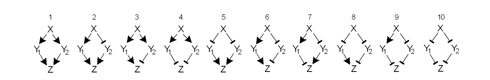

# The Diamonds




# Question:

The diamond pattern occurs when $X$ regulates $Y1$ and $Y2$, and both
$Y1$ and $Y2$ regulate gene $Z$. Analyze the 10 types of diamond
structures (where each edge is either activation + or repression -) with
respect to their steady-state responses to the inputs $S_x$, $Sy_1$ and
$Sy_2$. Use an `AND` input function at the $Z$ promoter. Do any diamond
types lack responsiveness to any input? To all three inputs?

(Question 4.8 from [An Introduction to Systems Biology: Design
Principles of Biological
Circuits](https://amazon.com/Introduction-Systems-Biology-Mathematical-Computational/dp/1439837171/))

# Answer:

## Define the diamond functions that perform specific logical operations on inputs $S_x$, $S_{y1}$, $S_{y2}$.

``` python
def diamond_1(Sx, Sy1, Sy2):
    """
    Function representing a logical operation on inputs Sx, Sy1, Sy2.
    Returns 1 if both (Sx AND Sy1) AND (Sx AND Sy2) are True, otherwise 0.
    """
    return int((Sx and Sy1) and (Sx and Sy2))

def diamond_2(Sx, Sy1, Sy2):
    """
    Function representing a logical operation on inputs Sx, Sy1, Sy2.
    Returns 1 if both (Sx AND Sy1) AND (NOT Sx AND Sy2) are True, otherwise 0.
    """
    return int((Sx and Sy1) and (not Sx and Sy2))

def diamond_3(Sx, Sy1, Sy2):
    """
    Function representing a logical operation on inputs Sx, Sy1, Sy2.
    Returns 1 if (Sx AND Sy1) AND (NOT Sx OR NOT Sy2) is True, otherwise 0.
    """
    return int((Sx and Sy1) and (not Sx or not Sy2))

def diamond_4(Sx, Sy1, Sy2):
    """
    Function representing a logical operation on inputs Sx, Sy1, Sy2.
    Returns 1 if (NOT Sx OR NOT Sy1) AND (NOT Sx OR NOT Sy2) is True, otherwise 0.
    """
    return int((not Sx or not Sy1) and (not Sx or not Sy2))

def diamond_5(Sx, Sy1, Sy2):
    """
    Function representing a logical operation on inputs Sx, Sy1, Sy2.
    Returns 1 if (NOT Sx AND Sy1) AND (NOT Sx AND Sy2) is True, otherwise 0.
    """
    return int((not Sx and Sy1) and (not Sx and Sy2))

def diamond_6(Sx, Sy1, Sy2):
    """
    Function representing a logical operation on inputs Sx, Sy1, Sy2.
    Returns 1 if (Sx AND Sy1) AND (Sx OR NOT Sy2) is True, otherwise 0.
    """
    return int((Sx and Sy1) and (Sx or not Sy2))

def diamond_7(Sx, Sy1, Sy2):
    """
    Function representing a logical operation on inputs Sx, Sy1, Sy2.
    Returns 1 if (NOT Sx OR NOT Sy1) AND (NOT Sx AND Sy2) is True, otherwise 0.
    """
    return int((not Sx or not Sy1) and (not Sx and Sy2))

def diamond_8(Sx, Sy1, Sy2):
    """
    Function representing a logical operation on inputs Sx, Sy1, Sy2.
    Returns 1 if (NOT Sx AND Sy1) AND (Sx OR NOT Sy2) is True, otherwise 0.
    """
    return int((not Sx and Sy1) and (Sx or not Sy2))

def diamond_9(Sx, Sy1, Sy2):
    """
    Function representing a logical operation on inputs Sx, Sy1, Sy2.
    Returns 1 if (NOT Sx OR NOT Sy1) AND (Sx OR NOT Sy2) is True, otherwise 0.
    """
    return int((not Sx or not Sy1) and (Sx or not Sy2))

def diamond_10(Sx, Sy1, Sy2):
    """
    Function representing a logical operation on inputs Sx, Sy1, Sy2.
    Returns 1 if (Sx OR NOT Sy1) AND (Sx OR NOT Sy2) is True, otherwise 0.
    """
    return int((Sx or not Sy1) and (Sx or not Sy2))
```

## Example of printing the output of specific diamonds

``` python
print(diamond_1(0, 0, 0))  # Output of diamond_1 for inputs 0, 0, 0
```

    0

``` python
print(diamond_4(0, 0, 0))  # Output of diamond_4 for inputs 0, 0, 0
```

    1

## Generate list of diamond names for table headers

``` python
diamonds = [f"D{i}" for i in range(1, 11)]
diamonds
```

    ['D1', 'D2', 'D3', 'D4', 'D5', 'D6', 'D7', 'D8', 'D9', 'D10']

``` python
headers = ["i", "Sx", "Sy1", "Sy2"] + diamonds  # Table headers
headers
```

    ['i',
     'Sx',
     'Sy1',
     'Sy2',
     'D1',
     'D2',
     'D3',
     'D4',
     'D5',
     'D6',
     'D7',
     'D8',
     'D9',
     'D10']

## Initialize the lists for each diamond function output

``` python
diamond_1_table = []
diamond_2_table = []
diamond_3_table = []
diamond_4_table = []
diamond_5_table = []
diamond_6_table = []
diamond_7_table = []
diamond_8_table = []
diamond_9_table = []
diamond_10_table = []
```

## Print the truth table for all diamonds

``` python
print("\t".join(headers))

# Generate the truth table for all combinations of Sx, Sy1, Sy2 and compute each diamond output
i = 0
for Sx in [0, 1]:
    for Sy1 in [0, 1]:
        for Sy2 in [0, 1]:
            # Compute output for all diamonds
            d1 = diamond_1(Sx, Sy1, Sy2)
            d2 = diamond_2(Sx, Sy1, Sy2)
            d3 = diamond_3(Sx, Sy1, Sy2)
            d4 = diamond_4(Sx, Sy1, Sy2)
            d5 = diamond_5(Sx, Sy1, Sy2)
            d6 = diamond_6(Sx, Sy1, Sy2)
            d7 = diamond_7(Sx, Sy1, Sy2)
            d8 = diamond_8(Sx, Sy1, Sy2)
            d9 = diamond_9(Sx, Sy1, Sy2)
            d10 = diamond_10(Sx, Sy1, Sy2)

            print(i, "\t", Sx, "\t", Sy1, "\t", Sy2, "\t", d1, "\t", d2, "\t", d3, "\t", d4, "\t", d5, "\t", d6, "\t", d7, "\t", d8, "\t", d9, "\t", d10)
            
            diamond_1_table.append(d1)
            diamond_2_table.append(d2)
            diamond_3_table.append(d3)
            diamond_4_table.append(d4)
            diamond_5_table.append(d5)
            diamond_6_table.append(d6)
            diamond_7_table.append(d7)
            diamond_8_table.append(d8)
            diamond_9_table.append(d9)
            diamond_10_table.append(d10)
            
            i += 1
```

    i   Sx  Sy1 Sy2 D1  D2  D3  D4  D5  D6  D7  D8  D9  D10
    0    0   0   0   0   0   0   1   0   0   0   0   1   1
    1    0   0   1   0   0   0   1   0   0   1   0   0   0
    2    0   1   0   0   0   0   1   0   0   0   1   1   0
    3    0   1   1   0   0   0   1   1   0   1   0   0   0
    4    1   0   0   0   0   0   1   0   0   0   0   1   1
    5    1   0   1   0   0   0   0   0   0   0   0   1   1
    6    1   1   0   0   0   1   0   0   1   0   0   0   1
    7    1   1   1   1   0   0   0   0   1   0   0   0   1

## Define functions to check sensitivity of diamond outputs to inputs $S_x$, $S_{y1}$, $S_{y2}$

These functions determine if the output of a diamond is dependent on the
inputs.

``` python
def is_sensitive_to_Sx(diamond):
  """
  Check if the diamond is sensitive to changes in Sx.
  Sensitivity occurs if the output changes when Sx changes.
  """
  flags = []
  for Sy1 in [0,1]:
    for Sy2 in [0,1]:
      flags.append(diamond[Sy1 * 2 + Sy2] != diamond[4 + Sy1 * 2 + Sy2])
  return any(flags)


def is_sensitive_to_Sy1(diamond):
  """
  Check if the diamond is sensitive to changes in Sy1.
  Sensitivity occurs if the output changes when Sy1 changes.
  """
  flags = []
  for Sx in [0,1]:
    for Sy2 in [0,1]:
      flags.append(diamond[Sx * 4 + Sy2] != diamond[Sx * 4 + 2 + Sy2])
  return any(flags)


def is_sensitive_to_Sy2(diamond):
  """
  Check if the diamond is sensitive to changes in Sy2.
  Sensitivity occurs if the output changes when Sy2 changes.
  """
  flags = []
  for Sx in [0,1]:
    for Sy1 in [0,1]:
      flags.append(diamond[Sx * 4 + Sy1 * 2] != diamond[Sx * 4 + Sy1 * 2 + 1])
  return any(flags)
```

## Checking sensitivity for each diamond

### Diamond 1

``` python
print ("Sensitive to Sx:\t", is_sensitive_to_Sx(diamond_1_table))
print ("Sensitive to Sy1:\t", is_sensitive_to_Sy1(diamond_1_table))
print ("Sensitive to Sy2:\t", is_sensitive_to_Sy2(diamond_1_table))
```

    Sensitive to Sx:     True
    Sensitive to Sy1:    True
    Sensitive to Sy2:    True

### Diamond 2

``` python
print ("Sensitive to Sx:\t", is_sensitive_to_Sx(diamond_2_table))
print ("Sensitive to Sy1:\t", is_sensitive_to_Sy1(diamond_2_table))
print ("Sensitive to Sy2:\t", is_sensitive_to_Sy2(diamond_2_table))
```

    Sensitive to Sx:     False
    Sensitive to Sy1:    False
    Sensitive to Sy2:    False

### Diamond 3

``` python
print ("Sensitive to Sx:\t", is_sensitive_to_Sx(diamond_3_table))
print ("Sensitive to Sy1:\t", is_sensitive_to_Sy1(diamond_3_table))
print ("Sensitive to Sy2:\t", is_sensitive_to_Sy2(diamond_3_table))
```

    Sensitive to Sx:     True
    Sensitive to Sy1:    True
    Sensitive to Sy2:    True

### Diamond 4

``` python
print ("Sensitive to Sx:\t", is_sensitive_to_Sx(diamond_4_table))
print ("Sensitive to Sy1:\t", is_sensitive_to_Sy1(diamond_4_table))
print ("Sensitive to Sy2:\t", is_sensitive_to_Sy2(diamond_4_table))
```

    Sensitive to Sx:     True
    Sensitive to Sy1:    True
    Sensitive to Sy2:    True

### Diamond 5

``` python
print ("Sensitive to Sx:\t", is_sensitive_to_Sx(diamond_5_table))
print ("Sensitive to Sy1:\t", is_sensitive_to_Sy1(diamond_5_table))
print ("Sensitive to Sy2:\t", is_sensitive_to_Sy2(diamond_5_table))
```

    Sensitive to Sx:     True
    Sensitive to Sy1:    True
    Sensitive to Sy2:    True

### Diamond 6

``` python
print ("Sensitive to Sx:\t", is_sensitive_to_Sx(diamond_6_table))
print ("Sensitive to Sy1:\t", is_sensitive_to_Sy1(diamond_6_table))
print ("Sensitive to Sy2:\t", is_sensitive_to_Sy2(diamond_6_table))
```

    Sensitive to Sx:     True
    Sensitive to Sy1:    True
    Sensitive to Sy2:    False

### Diamond 7

``` python
print ("Sensitive to Sx:\t", is_sensitive_to_Sx(diamond_7_table))
print ("Sensitive to Sy1:\t", is_sensitive_to_Sy1(diamond_7_table))
print ("Sensitive to Sy2:\t", is_sensitive_to_Sy2(diamond_7_table))
```

    Sensitive to Sx:     True
    Sensitive to Sy1:    False
    Sensitive to Sy2:    True

### Diamond 8

``` python
print ("Sensitive to Sx:\t", is_sensitive_to_Sx(diamond_8_table))
print ("Sensitive to Sy1:\t", is_sensitive_to_Sy1(diamond_8_table))
print ("Sensitive to Sy2:\t", is_sensitive_to_Sy2(diamond_8_table))
```

    Sensitive to Sx:     True
    Sensitive to Sy1:    True
    Sensitive to Sy2:    True

### Diamond 9

``` python
print ("Sensitive to Sx:\t", is_sensitive_to_Sx(diamond_9_table))
print ("Sensitive to Sy1:\t", is_sensitive_to_Sy1(diamond_9_table))
print ("Sensitive to Sy2:\t", is_sensitive_to_Sy2(diamond_9_table))
```

    Sensitive to Sx:     True
    Sensitive to Sy1:    True
    Sensitive to Sy2:    True

### Diamond 10

``` python
print ("Sensitive to Sx:\t", is_sensitive_to_Sx(diamond_10_table))
print ("Sensitive to Sy1:\t", is_sensitive_to_Sy1(diamond_10_table))
print ("Sensitive to Sy2:\t", is_sensitive_to_Sy2(diamond_10_table))
```

    Sensitive to Sx:     True
    Sensitive to Sy1:    True
    Sensitive to Sy2:    True

## Summary

Based on the results, Diamond 2 is not sensitive to any input, Diamond 6
shows no sensitivity to $S_{y2}$, and Diamond 7 shows no sensitivity to
$S_{y1}$.
